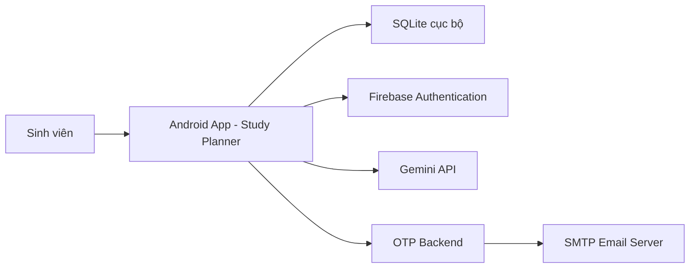

# SRS - Đặc Tả Yêu Cầu Phần Mềm

## 1. Giới Thiệu

### 1.1 Mục Đích

Tài liệu SRS mô tả yêu cầu chức năng, yêu cầu phi chức năng, tác nhân, use case, quy tắc nghiệp vụ và ràng buộc hệ thống của ứng dụng Study Planner.

### 1.2 Phạm Vi Sản Phẩm

Study Planner là ứng dụng Android hỗ trợ sinh viên quản lý lịch học, lịch thi, deadline, task, Pomodoro và thống kê học tập. Ứng dụng có xác thực bằng email/OTP và Google Sign-In, lưu dữ liệu học tập cục bộ theo từng tài khoản.

### 1.3 Thuật Ngữ

| Thuật ngữ | Ý nghĩa |
| --- | --- |
| OTP | Mã xác thực một lần gửi qua email |
| Task | Công việc học tập cần hoàn thành |
| Event | Lịch học, lịch thi, deadline hoặc công việc cá nhân có thời gian bắt đầu/kết thúc |
| Pomodoro | Phương pháp học tập theo phiên tập trung và nghỉ |
| Firebase Auth | Dịch vụ xác thực người dùng của Firebase |
| Gemini API | API AI dùng để đọc lịch học từ ảnh |
| SMTP | Giao thức gửi email dùng cho backend OTP |

## 2. Mô Tả Tổng Quan

### 2.1 Bối Cảnh Hệ Thống

Ứng dụng Android là thành phần chính. Backend OTP chỉ làm nhiệm vụ nhận email, mã OTP, mục đích xác thực rồi gửi email qua SMTP. Firebase Auth xử lý đăng nhập Google. Gemini API xử lý nhận diện ảnh lịch học.

### 2.2 Tác Nhân

| Actor | Mô tả |
| --- | --- |
| Sinh viên | Người dùng chính sử dụng app để quản lý lịch học |
| Firebase Auth | Dịch vụ ngoài xác thực Google |
| Gemini API | Dịch vụ ngoài đọc lịch từ ảnh |
| OTP Backend | Backend phụ trợ gửi mã OTP |
| SMTP Server | Máy chủ email gửi OTP |

### 2.3 Môi Trường Vận Hành

- Android minSdk 24, targetSdk 36.
- Java 11 cho Android compile options và backend.
- Gradle/Android Gradle Plugin.
- Thiết bị/emulator có Internet cho các chức năng online.

## 3. Yêu Cầu Chức Năng

| Mã | Tên yêu cầu | Mô tả | Độ ưu tiên |
| --- | --- | --- | --- |
| FR-01 | Onboarding | Hiển thị màn hình giới thiệu lần đầu mở app | Trung bình |
| FR-02 | Đăng ký email | Người dùng nhập tên, email, mật khẩu, xác nhận mật khẩu và đồng ý điều khoản | Cao |
| FR-03 | Gửi OTP đăng ký | App tạo OTP, lưu hash OTP và gửi OTP qua backend email | Cao |
| FR-04 | Xác thực OTP đăng ký | Người dùng nhập OTP hợp lệ để kích hoạt tài khoản | Cao |
| FR-05 | Đăng nhập email | Người dùng đăng nhập bằng email và mật khẩu đã xác thực | Cao |
| FR-06 | Quên mật khẩu | Người dùng yêu cầu OTP đặt lại mật khẩu | Cao |
| FR-07 | Đặt lại mật khẩu | Người dùng nhập OTP và mật khẩu mới | Cao |
| FR-08 | Đăng nhập Google | Người dùng đăng nhập bằng tài khoản Google qua Firebase Auth | Cao |
| FR-09 | Đăng xuất | Người dùng đăng xuất khỏi app và Firebase/Google nếu có | Cao |
| FR-10 | Quản lý hồ sơ | Người dùng sửa tên, email, mục tiêu học tập | Trung bình |
| FR-11 | Cá nhân hóa giao diện | Người dùng chọn avatar, mascot, nền dashboard, màu chủ đề, trạng thái học tập | Trung bình |
| FR-12 | Xem dashboard | App hiển thị tiến độ hôm nay, task, deadline, lịch tiếp theo, Pomodoro | Cao |
| FR-13 | Thêm lịch | Người dùng tạo event với tiêu đề, loại, môn, ngày, giờ, phòng, ghi chú, nhắc nhở | Cao |
| FR-14 | Sửa lịch | Người dùng cập nhật thông tin event đã tạo | Cao |
| FR-15 | Xóa lịch | Người dùng xóa event khỏi danh sách | Cao |
| FR-16 | Lọc lịch | Người dùng lọc theo tất cả, lịch học, lịch thi, deadline, cá nhân | Trung bình |
| FR-17 | Xem lịch ngày/3 ngày/tuần | Người dùng chuyển chế độ xem lịch | Trung bình |
| FR-18 | Kiểm tra xung đột | App cảnh báo khi event trùng thời gian với event khác | Cao |
| FR-19 | Nhập lịch từ ảnh | Người dùng chọn camera/thư viện để trích xuất event bằng Gemini API | Cao |
| FR-20 | Thêm task | Người dùng tạo task học tập với deadline, ưu tiên, ghi chú | Cao |
| FR-21 | Sửa task | Người dùng cập nhật task | Cao |
| FR-22 | Xóa task | Người dùng xóa task | Cao |
| FR-23 | Đánh dấu hoàn thành task | Người dùng chuyển task sang trạng thái đã xong | Cao |
| FR-24 | Lọc task | Lọc task theo tất cả, hôm nay, sắp hạn, quá hạn, đã xong, môn, ưu tiên, ma trận | Cao |
| FR-25 | Gắn marker task | Người dùng chọn biểu tượng/marker cho task | Thấp |
| FR-26 | Chạy Pomodoro | Người dùng bắt đầu, tạm dừng, đặt lại và bỏ qua phiên Pomodoro | Cao |
| FR-27 | Chọn task Pomodoro | Người dùng gắn phiên Pomodoro với task/môn học | Trung bình |
| FR-28 | Âm thanh Pomodoro | Người dùng chọn âm thanh nền hoặc white noise | Trung bình |
| FR-29 | Lịch sử Pomodoro | Người dùng xem các phiên Pomodoro đã ghi nhận | Trung bình |
| FR-30 | Thống kê | App hiển thị thống kê task, lịch, tiến độ và thời gian tập trung | Cao |
| FR-31 | Cài đặt thông báo | Người dùng bật/tắt thông báo nhắc nhở | Trung bình |
| FR-32 | Cài đặt đồng bộ | Người dùng bật/tắt lựa chọn đồng bộ Google Calendar ở mức cấu hình UI | Thấp |

## 4. Yêu Cầu Phi Chức Năng

| Mã | Nhóm | Yêu cầu |
| --- | --- | --- |
| NFR-01 | Hiệu năng | Các thao tác CRUD dữ liệu cục bộ phản hồi trong thời gian ngắn với dữ liệu học tập cá nhân |
| NFR-02 | Bảo mật | Mật khẩu và OTP không lưu plaintext; sử dụng SHA-256 kết hợp salt/hash |
| NFR-03 | Bảo mật | Không commit API key, SMTP password, local.properties, keystore |
| NFR-04 | Tin cậy | OTP hết hạn sau 5 phút và giới hạn số lần nhập sai |
| NFR-05 | Tính dùng được | Giao diện tiếng Việt, phù hợp sinh viên, có dashboard tổng quan |
| NFR-06 | Tương thích | Hỗ trợ Android từ API 24 trở lên |
| NFR-07 | Khả năng bảo trì | Mã chia thành model, data repository, UI custom view, backend riêng |
| NFR-08 | Khả năng mở rộng | Có thể nâng cấp lưu trữ local sang cloud sync trong tương lai |
| NFR-09 | Khả năng phục hồi | Nếu backend OTP/Gemini lỗi, app hiển thị thông báo lỗi thay vì crash |
| NFR-10 | Cấu hình | Các khóa nhạy cảm được lấy từ `local.properties` hoặc biến môi trường |

## 5. Use Case Chính

| Mã | Use case | Actor chính | Mô tả ngắn |
| --- | --- | --- | --- |
| UC-01 | Đăng ký tài khoản | Sinh viên | Tạo tài khoản email và nhận OTP |
| UC-02 | Xác thực OTP | Sinh viên | Nhập OTP để kích hoạt tài khoản |
| UC-03 | Đăng nhập email | Sinh viên | Truy cập app bằng email/mật khẩu |
| UC-04 | Đăng nhập Google | Sinh viên | Truy cập app bằng tài khoản Google |
| UC-05 | Quên mật khẩu | Sinh viên | Nhận OTP và đặt mật khẩu mới |
| UC-06 | Quản lý lịch học | Sinh viên | Thêm, sửa, xóa, lọc event |
| UC-07 | Tạo lịch từ ảnh | Sinh viên | Dùng Gemini đọc ảnh lịch và lưu event |
| UC-08 | Quản lý task | Sinh viên | Thêm, sửa, xóa, hoàn thành, lọc task |
| UC-09 | Chạy Pomodoro | Sinh viên | Bắt đầu phiên tập trung và lưu thống kê |
| UC-10 | Xem thống kê | Sinh viên | Xem tiến độ học tập |
| UC-11 | Cài đặt cá nhân | Sinh viên | Sửa hồ sơ, giao diện, thông báo |

## 6. Quy Tắc Nghiệp Vụ

| Mã | Quy tắc |
| --- | --- |
| BR-01 | Email đăng ký phải đúng định dạng email |
| BR-02 | Mật khẩu tối thiểu 6 ký tự |
| BR-03 | Mật khẩu xác nhận phải trùng mật khẩu đăng ký |
| BR-04 | Người dùng phải đồng ý điều khoản trước khi đăng ký |
| BR-05 | Tài khoản email chưa xác thực OTP không được đăng nhập |
| BR-06 | OTP có hiệu lực 5 phút |
| BR-07 | OTP nhập sai quá 5 lần sẽ bị hủy |
| BR-08 | Event phải có thời gian kết thúc sau thời gian bắt đầu |
| BR-09 | Khi event trùng thời gian, app phải cảnh báo xung đột |
| BR-10 | Task quá hạn là task chưa hoàn thành và deadline nhỏ hơn thời gian hiện tại |
| BR-11 | Pomodoro focus hoàn thành sẽ cộng vào thống kê tập trung |
| BR-12 | Dữ liệu học tập được tách theo tài khoản email nếu người dùng đăng nhập |

## 7. Ràng Buộc Hệ Thống

- Package name Android: `com.example.cuoiky_qllichhoctap`.
- App dùng `google-services.json` trong module `app`.
- Backend OTP mặc định chạy ở `http://10.0.2.2:8080` trên emulator.
- Gemini API key đọc từ `local.properties` qua `BuildConfig.GEMINI_API_KEY`.
- OTP backend đọc SMTP config từ biến môi trường.
- Dữ liệu app lưu trong SQLite trên thiết bị, không đồng bộ server.

## 8. Tiêu Chí Chấp Nhận

- Build debug thành công.
- App không crash khi mở các màn hình chính.
- Luồng đăng ký OTP hoạt động khi backend SMTP hoạt động.
- Google Sign-In hoạt động khi Firebase SHA-1/OAuth đúng.
- Task/event được lưu và hiển thị lại sau khi đóng/mở app.
- Pomodoro cập nhật thống kê sau phiên hoàn thành.
- Import ảnh hiển thị lỗi rõ ràng nếu thiếu Gemini API key.
