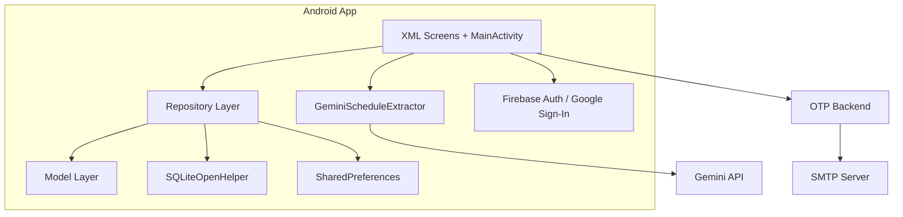
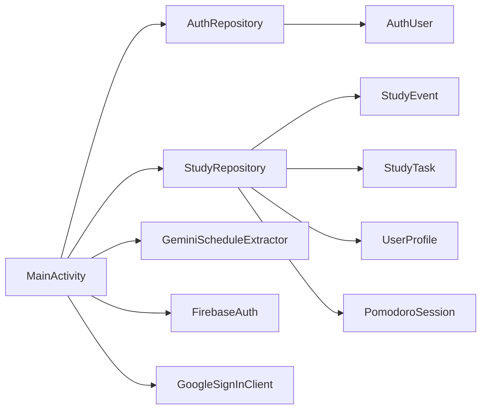
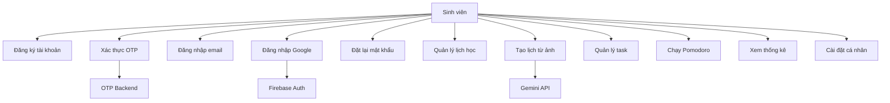
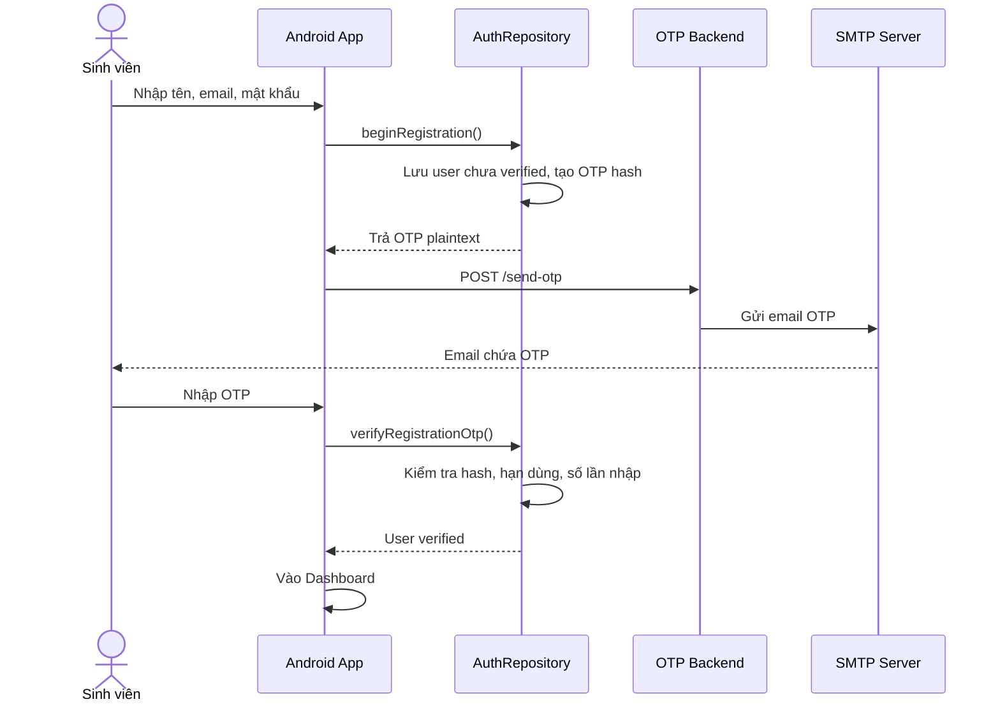
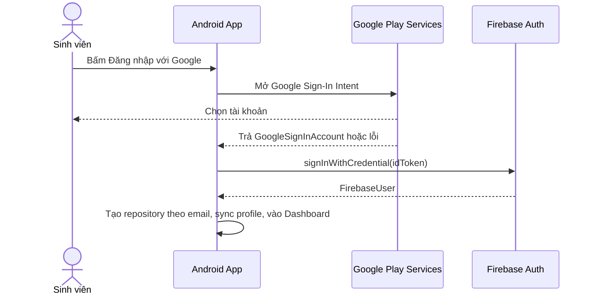
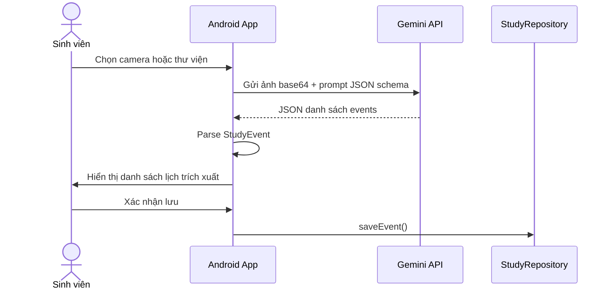
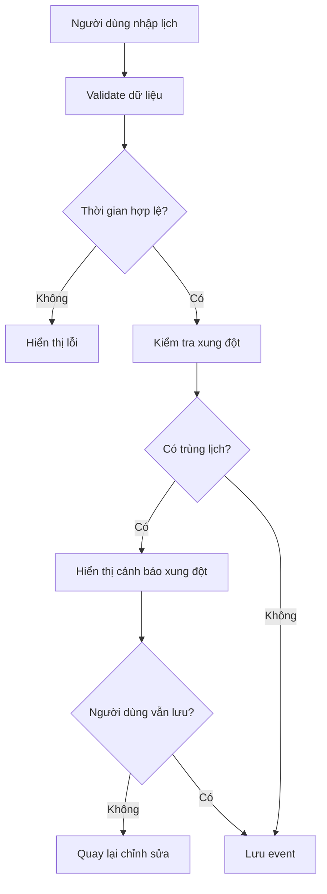
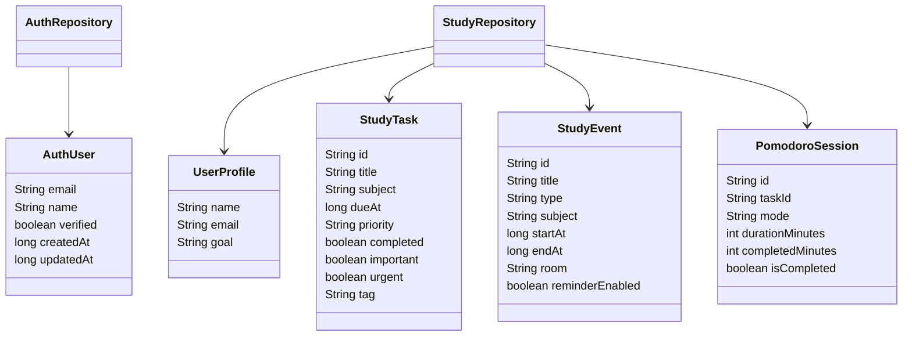

# Phân Tích Và Thiết Kế Hệ Thống

## 1. Phân Tích Hiện Trạng

Sinh viên thường quản lý việc học bằng nhiều công cụ khác nhau: lịch điện thoại, ghi chú, giấy, ứng dụng task hoặc nhắc nhở. Việc phân tán dữ liệu dẫn tới các vấn đề:

- Khó nhìn tổng quan lịch học, deadline và task trong một màn hình.
- Dễ tạo lịch trùng giờ.
- Khó biết hôm nay cần ưu tiên việc gì.
- Không đo được thời gian tập trung thực tế.
- Nhập lịch thủ công từ ảnh thời khóa biểu mất thời gian.

Study Planner giải quyết bằng một ứng dụng Android tập trung vào lịch học cá nhân, task, Pomodoro, thống kê và hỗ trợ nhập lịch từ ảnh.

## 2. Kiến Trúc Tổng Thể



## 3. Thành Phần Chính

| Thành phần | File/Module | Vai trò |
| --- | --- | --- |
| MainActivity | `app/src/main/java/.../MainActivity.java` | Điều phối màn hình, sự kiện UI, xác thực, Pomodoro, CRUD |
| AuthRepository | `data/AuthRepository.java` | Quản lý tài khoản email, mật khẩu hash, OTP, session |
| StudyRepository | `data/StudyRepository.java` | Quản lý profile, task, event, settings, thống kê, Pomodoro |
| GeminiScheduleExtractor | `data/GeminiScheduleExtractor.java` | Gửi ảnh tới Gemini API và parse event |
| Model | `model/*.java` | Định nghĩa dữ liệu nghiệp vụ |
| Custom UI | `ui/*.java` | Biểu đồ, calendar view, swipe action, nền giấy |
| OTP Backend | `otp-backend` | HTTP server gửi OTP qua SMTP |

## 4. Thiết Kế Module Android



## 5. Sơ Đồ Use Case



## 6. Luồng Xử Lý Chính

### 6.1 Đăng Ký Và Xác Thực OTP



### 6.2 Đăng Nhập Google



Ghi chú: luồng này phụ thuộc SHA-1/OAuth trong Firebase Console. Nếu SHA-1 không khớp, Google Play Services trả lỗi ứng dụng chưa đăng ký OAuth2.

### 6.3 Tạo Lịch Từ Ảnh



### 6.4 Lưu Lịch Và Kiểm Tra Xung Đột



## 7. Thiết Kế Giao Diện

| Màn hình | File layout | Chức năng |
| --- | --- | --- |
| Onboarding | `screen_onboarding.xml` | Giới thiệu app |
| Login | `screen_login.xml` | Đăng nhập email/Google, quên mật khẩu |
| Register | `screen_register.xml` | Đăng ký tài khoản |
| OTP | `screen_otp.xml` | Nhập/gửi lại OTP |
| Reset Password | `screen_reset_password.xml` | Đặt mật khẩu mới |
| Dashboard | `screen_dashboard.xml` | Tổng quan tiến độ, task, lịch, Pomodoro |
| Schedule | `screen_schedule.xml` | Quản lý lịch học |
| Tasks | `screen_tasks.xml` | Quản lý task |
| Pomodoro | `screen_pomodoro.xml` | Timer tập trung |
| Stats | `screen_stats.xml` | Thống kê học tập |
| Settings | `screen_settings.xml` | Hồ sơ, cá nhân hóa, đăng xuất |

## 8. Thiết Kế Lớp



## 9. Thiết Kế API Backend OTP

### 9.1 `GET /health`

Kiểm tra backend còn chạy.

Response:

```json
{"ok": true}
```

### 9.2 `POST /send-otp`

Gửi OTP qua email.

Request:

```json
{
  "email": "student@example.com",
  "code": "123456",
  "purpose": "xác thực tài khoản"
}
```

Response thành công:

```json
{"ok": true}
```

Response lỗi:

```json
{
  "ok": false,
  "error": "Missing email or code"
}
```

## 10. Cấu Trúc Thư Mục

```text
MANAGING-YOUR-STUDY-SCHEDULE/
├── app/
│   ├── build.gradle.kts
│   └── src/main/
│       ├── java/com/example/cuoiky_qllichhoctap/
│       │   ├── MainActivity.java
│       │   ├── data/
│       │   ├── model/
│       │   ├── ui/
│       │   └── util/
│       └── res/
│           ├── layout/
│           ├── drawable/
│           ├── values/
│           └── raw/
├── otp-backend/
│   └── src/main/java/com/example/otpbackend/OtpMailServer.java
├── gradle/
├── docs/
└── README.md
```

## 11. Hạn Chế Thiết Kế Hiện Tại

- `MainActivity` đang xử lý nhiều trách nhiệm UI và nghiệp vụ, có thể tách ViewModel/Controller ở phiên bản sau.
- Google Sign-In đang dùng API legacy của `play-services-auth`; có thể nâng cấp Credential Manager.
- Đồng bộ Google Calendar mới có cấu hình UI, chưa có tích hợp Calendar API đầy đủ.
- Dữ liệu học tập lưu local, chưa có cloud backup/sync.
