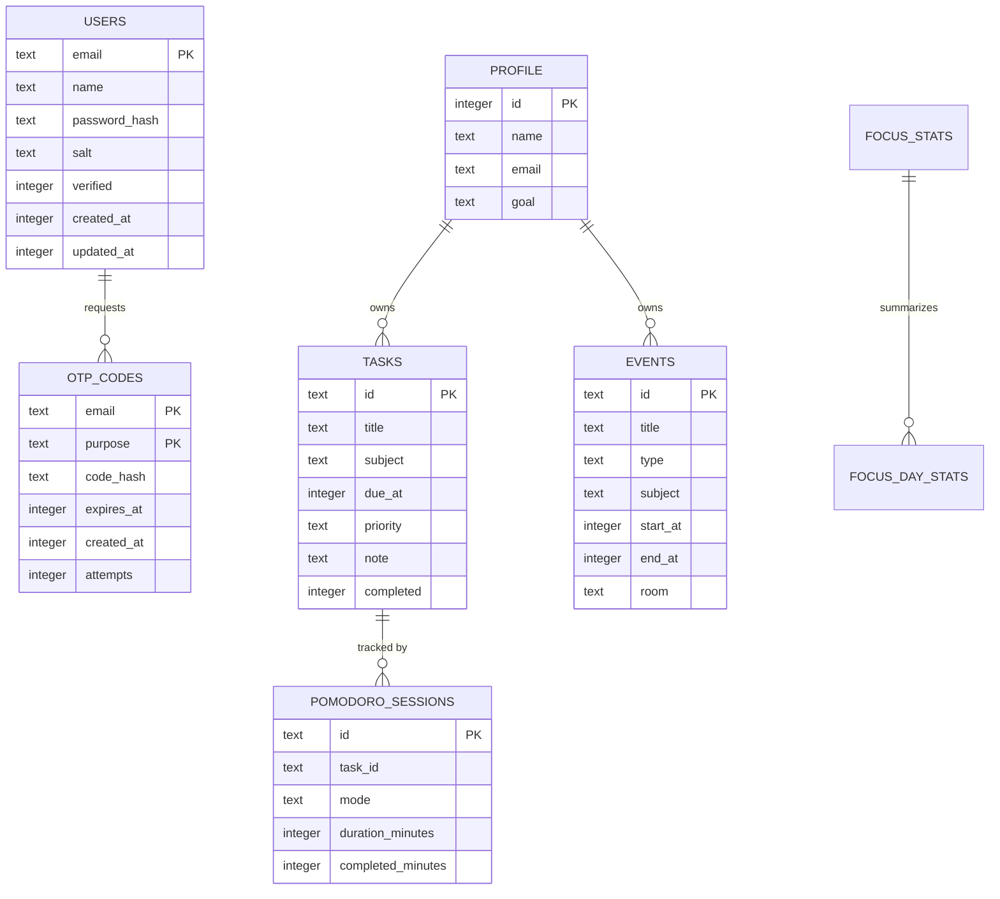

# Thiết Kế Dữ Liệu

## 1. Tổng Quan

Ứng dụng Study Planner sử dụng SQLite cục bộ trên Android để lưu dữ liệu xác thực email, hồ sơ, task, lịch học, thống kê Pomodoro và cài đặt. Ngoài SQLite, app dùng SharedPreferences để lưu trạng thái mở lần đầu, session và lựa chọn cá nhân hóa.

Backend OTP không lưu dữ liệu lâu dài; backend chỉ nhận request gửi OTP và chuyển tiếp qua SMTP.

## 2. Danh Sách Cơ Sở Dữ Liệu

| Database | File quản lý | Mục đích |
| --- | --- | --- |
| `study_auth.db` | `AuthRepository.java` | Lưu user email, hash mật khẩu, OTP hash |
| `study_planner.db` hoặc `study_planner_<hash>.db` | `StudyRepository.java` | Lưu profile, task, event, Pomodoro, settings |

Khi người dùng đăng nhập bằng email, dữ liệu học tập được tách theo email bằng suffix hash trong tên database và SharedPreferences.

## 3. ERD Tổng Quan

## 4. Database `study_auth.db`

### 4.1 Bảng `users`

| Trường | Kiểu | Khóa | Bắt buộc | Mô tả |
| --- | --- | --- | --- | --- |
| `email` | TEXT | PK | Có | Email đã normalize lowercase |
| `name` | TEXT |  | Có | Tên người dùng |
| `password_hash` | TEXT |  | Có | Hash mật khẩu bằng SHA-256 |
| `salt` | TEXT |  | Có | Salt random dùng khi hash mật khẩu |
| `verified` | INTEGER |  | Có | 0: chưa xác thực, 1: đã xác thực |
| `created_at` | INTEGER |  | Có | Thời điểm tạo tài khoản, milliseconds |
| `updated_at` | INTEGER |  | Có | Thời điểm cập nhật gần nhất |

Ràng buộc:

- `email` là duy nhất.
- Tài khoản chưa verified không được đăng nhập.
- Không lưu mật khẩu plaintext.

### 4.2 Bảng `otp_codes`

| Trường | Kiểu | Khóa | Bắt buộc | Mô tả |
| --- | --- | --- | --- | --- |
| `email` | TEXT | PK | Có | Email nhận OTP |
| `purpose` | TEXT | PK | Có | `register` hoặc `reset` |
| `code_hash` | TEXT |  | Có | Hash OTP theo email, purpose, code |
| `expires_at` | INTEGER |  | Có | Thời điểm hết hạn |
| `created_at` | INTEGER |  | Có | Thời điểm tạo OTP |
| `attempts` | INTEGER |  | Có | Số lần nhập sai |

Ràng buộc:

- Khóa chính ghép: (`email`, `purpose`).
- OTP hết hạn sau 5 phút.
- Nhập sai tối đa 5 lần.

## 5. Database `study_planner.db`

### 5.1 Bảng `profile`

| Trường | Kiểu | Khóa | Bắt buộc | Mô tả |
| --- | --- | --- | --- | --- |
| `id` | INTEGER | PK | Có | Luôn bằng 1 |
| `name` | TEXT |  | Có | Tên hiển thị |
| `email` | TEXT |  | Có | Email hồ sơ |
| `goal` | TEXT |  | Có | Mục tiêu học tập |

### 5.2 Bảng `tasks`

| Trường | Kiểu | Khóa | Bắt buộc | Mô tả |
| --- | --- | --- | --- | --- |
| `id` | TEXT | PK | Có | UUID task |
| `title` | TEXT |  | Có | Tên công việc |
| `subject` | TEXT |  | Có | Môn học |
| `due_at` | INTEGER | INDEX | Có | Deadline dạng milliseconds |
| `priority` | TEXT |  | Có | Cao, Trung bình, Thấp |
| `note` | TEXT |  | Không | Ghi chú |
| `completed` | INTEGER |  | Có | 0/1 |
| `important` | INTEGER |  | Có | Dùng cho ma trận ưu tiên |
| `urgent` | INTEGER |  | Có | Dùng cho ma trận ưu tiên |
| `tag` | TEXT |  | Không | Tag hoặc môn học |
| `reminder_time` | INTEGER |  | Có | Thời điểm nhắc nhở, 0 nếu không có |
| `repeat_option` | TEXT |  | Có | Không lặp, hằng ngày, hằng tuần, hằng tháng |
| `estimated_pomodoro` | INTEGER |  | Có | Số phiên Pomodoro dự kiến |
| `completed_pomodoros` | INTEGER |  | Có | Số phiên hoàn thành, cột tương thích |
| `marker_type` | TEXT |  | Có | Loại marker task |
| `marker_value` | TEXT |  | Có | Giá trị marker |

Index:

- `idx_tasks_due_at` trên `due_at`.

### 5.3 Bảng `events`

| Trường | Kiểu | Khóa | Bắt buộc | Mô tả |
| --- | --- | --- | --- | --- |
| `id` | TEXT | PK | Có | UUID event |
| `title` | TEXT |  | Có | Tên lịch |
| `type` | TEXT |  | Có | Lịch học, Lịch thi, Deadline, Công việc cá nhân |
| `subject` | TEXT |  | Có | Môn học/chủ đề |
| `start_at` | INTEGER | INDEX | Có | Thời điểm bắt đầu |
| `end_at` | INTEGER |  | Có | Thời điểm kết thúc |
| `room` | TEXT |  | Không | Phòng học/địa điểm |
| `note` | TEXT |  | Không | Ghi chú |
| `reminder_enabled` | INTEGER |  | Có | 0/1 |
| `reminder_before_minutes` | INTEGER |  | Có | Số phút nhắc trước |

Index:

- `idx_events_start_at` trên `start_at`.

Ràng buộc nghiệp vụ:

- `end_at` phải lớn hơn `start_at`.
- Event mới được kiểm tra xung đột với event khác trước khi lưu.

### 5.4 Bảng `focus_stats`

| Trường | Kiểu | Khóa | Bắt buộc | Mô tả |
| --- | --- | --- | --- | --- |
| `id` | INTEGER | PK | Có | Luôn bằng 1 |
| `minutes` | INTEGER |  | Có | Tổng phút tập trung |
| `sessions` | INTEGER |  | Có | Tổng số phiên |

### 5.5 Bảng `focus_day_stats`

| Trường | Kiểu | Khóa | Bắt buộc | Mô tả |
| --- | --- | --- | --- | --- |
| `day_key` | TEXT | PK | Có | Ngày dạng chuỗi |
| `minutes` | INTEGER |  | Có | Phút tập trung trong ngày |
| `sessions` | INTEGER |  | Có | Số phiên trong ngày |

### 5.6 Bảng `pomodoro_sessions`

| Trường | Kiểu | Khóa | Bắt buộc | Mô tả |
| --- | --- | --- | --- | --- |
| `id` | TEXT | PK | Có | UUID phiên |
| `task_id` | TEXT |  | Không | Task liên kết |
| `subject_tag` | TEXT |  | Không | Môn/tag liên kết |
| `mode` | TEXT |  | Không | `focus`, `short_break`, `long_break` |
| `duration_minutes` | INTEGER |  | Không | Thời lượng phiên |
| `completed_minutes` | INTEGER |  | Không | Số phút đã hoàn thành |
| `started_at` | INTEGER |  | Không | Thời điểm bắt đầu |
| `ended_at` | INTEGER |  | Không | Thời điểm kết thúc |
| `is_completed` | INTEGER |  | Không | 0/1 |
| `sound_type` | TEXT |  | Không | Âm thanh đã dùng |
| `created_at` | INTEGER |  | Không | Thời điểm lưu |

### 5.7 Bảng `settings`

| Trường | Kiểu | Khóa | Bắt buộc | Mô tả |
| --- | --- | --- | --- | --- |
| `key` | TEXT | PK | Có | Tên cài đặt |
| `value` | TEXT |  | Có | Giá trị cài đặt |

Ví dụ:

- `notify`: `1` hoặc `0`.
- `sync`: `1` hoặc `0`.

## 6. SharedPreferences

### 6.1 `study_auth_session`

| Key | Mô tả |
| --- | --- |
| `session_email` | Email tài khoản đang đăng nhập local |

### 6.2 `study_planner_store` hoặc `study_planner_store_<hash>`

| Key | Mô tả |
| --- | --- |
| `first_open` | Đã hoàn thành onboarding chưa |
| `logged_in` | Trạng thái đăng nhập UI |
| `avatar` | Lựa chọn avatar |
| `dashboard_background` | Lựa chọn nền dashboard |
| `theme_color` | Màu chủ đề |
| `mascot` | Mascot |
| `study_status` | Trạng thái học tập |

## 7. Dữ Liệu Mẫu

Khi chưa có profile và chưa scoped theo tài khoản, app seed dữ liệu mẫu:

- Event: Toán rời rạc, Thi Cấu trúc dữ liệu, Họp nhóm Mobile.
- Task: Làm bài tập Chương 4, Đọc tài liệu Android, Ôn tập kiểm tra, Tóm tắt bài giảng.
- Profile mặc định: Minh Anh, `student@email.com`, mục tiêu quản lý lịch học và deadline.

## 8. Chính Sách Bảo Mật Dữ Liệu

- Mật khẩu lưu dưới dạng hash có salt.
- OTP lưu dưới dạng hash, không lưu OTP plaintext sau khi tạo.
- API key và mật khẩu SMTP không lưu trong mã nguồn.
- `google-services.json` và `local.properties` không nên commit nếu chứa thông tin riêng của project thật.

## 9. Hạn Chế Và Đề Xuất Nâng Cấp

| Hạn chế | Đề xuất |
| --- | --- |
| Dữ liệu local không đồng bộ cloud | Thêm Firebase Firestore hoặc backend riêng |
| Chưa có migration phức tạp | Dùng Room Database để quản lý migration rõ hơn |
| Session local tách với Firebase session | Đồng bộ hóa session và trạng thái Firebase chặt hơn |
| Backend OTP không lưu log kiểm toán | Thêm logging và rate limit nếu triển khai thật |
