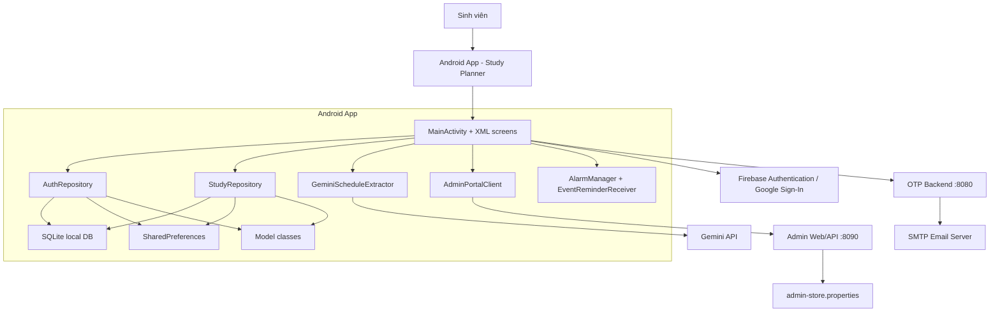
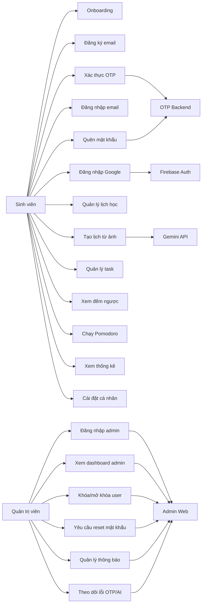
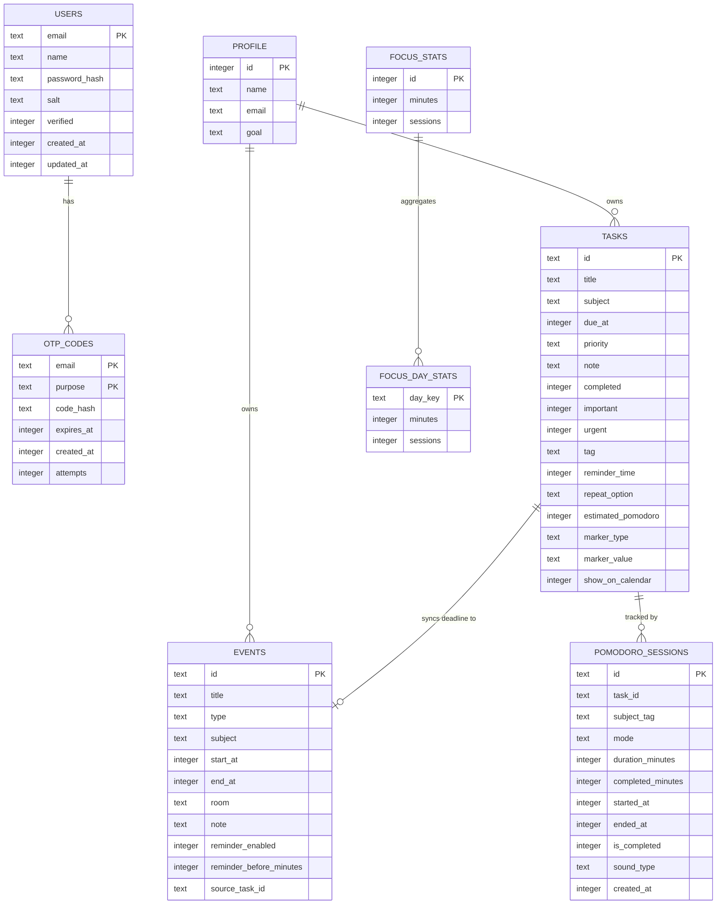
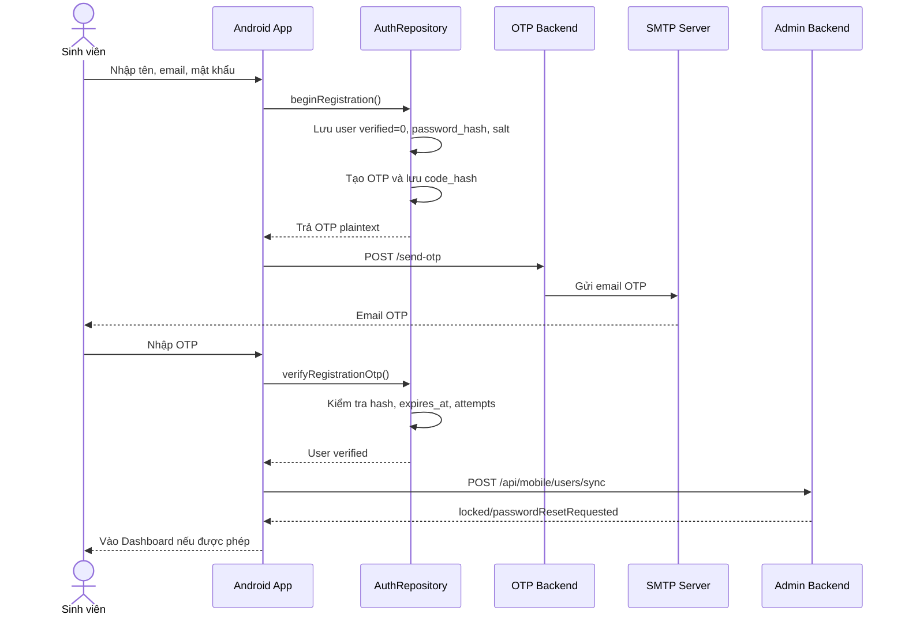
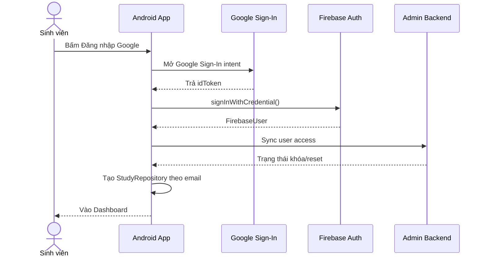
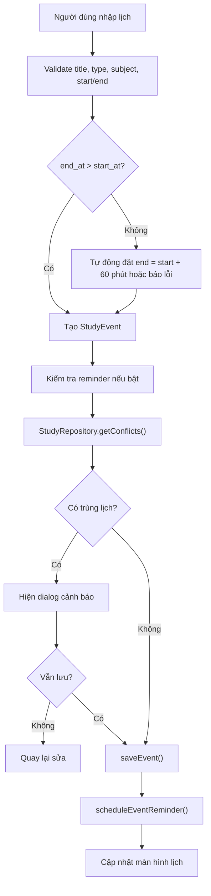
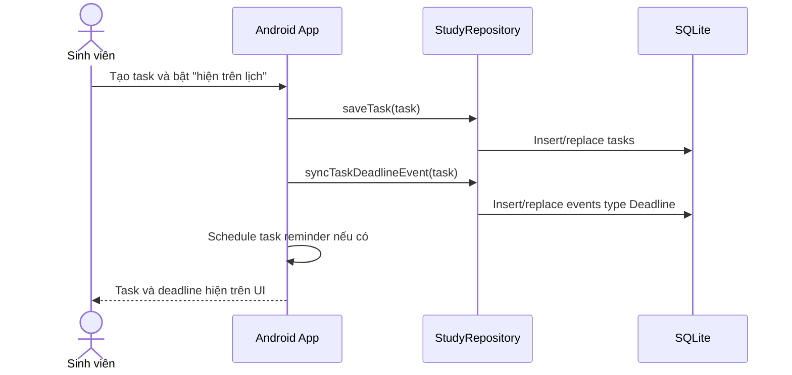
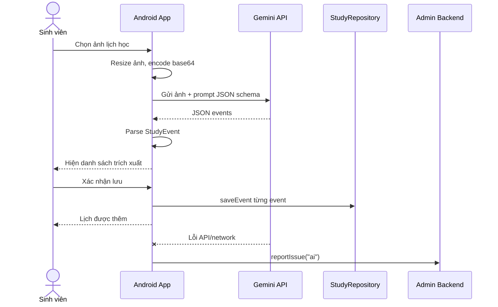
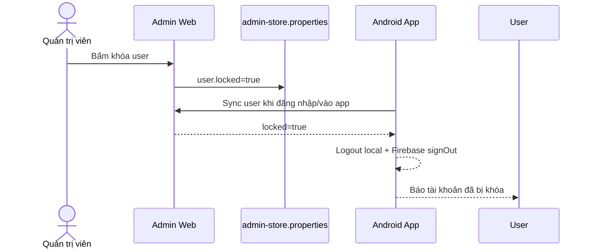
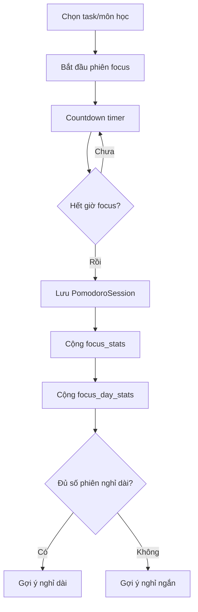

# Tài liệu thuyết trình đồ án Study Planner

Tên dự án: **Managing Your Study Schedule / Study Planner**  
Nền tảng chính: **Android Java/XML**  
Mục tiêu: Hỗ trợ sinh viên quản lý lịch học, lịch thi, deadline, công việc học tập, Pomodoro và tiến độ học tập trong một ứng dụng duy nhất.

---

## 1. Tóm tắt nhanh để thuyết trình

Study Planner là ứng dụng Android giúp sinh viên quản lý việc học hằng ngày. Ứng dụng có các chức năng chính:

- Đăng ký, đăng nhập bằng email/password có xác thực OTP qua email.
- Đăng nhập bằng Google thông qua Firebase Authentication.
- Quản lý lịch học, lịch thi, deadline và công việc cá nhân.
- Xem lịch theo ngày, 3 ngày hoặc tuần.
- Kiểm tra xung đột lịch khi tạo/sửa lịch.
- Tạo lịch từ hình ảnh thời khóa biểu bằng Gemini API.
- Quản lý task/deadline, đánh dấu hoàn thành, lọc theo trạng thái, độ ưu tiên, tag và ma trận quan trọng/khẩn cấp.
- Đồng bộ deadline của task sang lịch nếu người dùng bật tùy chọn hiển thị trên lịch.
- Màn hình đếm ngược các mốc sắp đến hoặc quá hạn.
- Pomodoro tập trung, âm thanh nền, lịch sử phiên học và thống kê thời gian tập trung.
- Nhắc nhở lịch/task bằng notification local trên Android.
- Web admin riêng để quản lý registry tài khoản, khóa/mở khóa user, yêu cầu reset mật khẩu, tạo thông báo và theo dõi lỗi OTP/AI.

Điểm cần nói rõ khi bảo vệ:

> Dữ liệu học tập hiện tại **không lưu trên Firebase Database**. Dữ liệu chính được lưu bằng **SQLite local trên thiết bị Android**. Firebase hiện được dùng cho **Google Sign-In/Firebase Authentication**, không phải Firestore hay Realtime Database.

---

## 2. Bài toán và lý do xây dựng

Sinh viên thường phải theo dõi nhiều loại thông tin:

- Lịch học trên lớp.
- Lịch thi.
- Deadline nộp bài.
- Công việc cần làm theo môn học.
- Thời gian tập trung học.
- Các thông báo hoặc yêu cầu từ quản trị viên.

Nếu dùng nhiều công cụ riêng lẻ như ghi chú, lịch điện thoại, file Excel hoặc Google Calendar, dữ liệu dễ bị rời rạc. Study Planner giải quyết bằng cách gom nhiều chức năng học tập vào một ứng dụng:

- Xem tổng quan ngày học.
- Quản lý lịch và task ở cùng một nơi.
- Nhắc nhở trước khi đến lịch/deadline.
- Đo thời gian tập trung bằng Pomodoro.
- Nhập lịch nhanh từ ảnh thời khóa biểu.
- Có web admin để theo dõi tài khoản, thông báo và lỗi hệ thống.

---

## 3. Phạm vi dự án

### 3.1 Đã có trong dự án hiện tại

| Nhóm | Nội dung |
| --- | --- |
| Android app | Ứng dụng chính cho sinh viên |
| SQLite local | Lưu tài khoản local, OTP hash, profile, task, lịch, Pomodoro, settings |
| Firebase Auth | Đăng nhập Google |
| OTP backend | Gửi OTP qua SMTP email |
| Admin web | Quản lý registry tài khoản, thông báo, lỗi OTP/AI |
| Gemini API | Đọc lịch học từ ảnh |
| Notification | Nhắc nhở lịch/task và kết thúc Pomodoro |

### 3.2 Chưa có trong dự án hiện tại

| Mục | Trạng thái |
| --- | --- |
| Firestore / Realtime Database | Chưa dùng |
| Cloud sync dữ liệu lịch/task lên Firebase | Chưa có |
| Admin xem trực tiếp lịch học cá nhân của từng user | Chưa có |
| Backend auth tập trung cho email/password | Chưa có, email/password đang lưu local trên máy |
| Google Calendar API sync thật | Chưa tích hợp đầy đủ |

Nếu giáo viên hỏi: "Firebase có xem database được không?", trả lời:

> Có, Firebase có Firestore và Realtime Database, có thể xem dữ liệu trên Firebase Console. Tuy nhiên đồ án hiện tại mới dùng Firebase cho Google Sign-In/Firebase Authentication, còn dữ liệu lịch học/task/Pomodoro đang lưu local bằng SQLite trên thiết bị.

---

## 4. Công nghệ sử dụng

| Thành phần | Công nghệ |
| --- | --- |
| Mobile app | Android native |
| Ngôn ngữ mobile | Java |
| UI mobile | XML layout, Material Components, custom View |
| Database mobile | SQLiteOpenHelper |
| Local key-value | SharedPreferences |
| Authentication Google | Firebase Authentication + Google Sign-In |
| AI đọc lịch từ ảnh | Gemini API |
| Backend OTP | Java HTTP Server |
| Gửi email OTP | SMTP, Jakarta Mail |
| Admin web | Java HTTP Server + HTML/CSS/JavaScript |
| Build tool | Gradle Kotlin DSL |
| Minimum Android | minSdk 24 |
| Target Android | targetSdk 36 |

---

## 5. Hướng dẫn cây thư mục và vai trò từng file

Phần này giúp người đọc quan sát cây thư mục trong Android Studio và biết file nào dùng để làm gì.

### 5.1 Cây thư mục tổng quan

```text
MANAGING-YOUR-STUDY-SCHEDULE/
├── app/                         # Module Android chính
├── admin-web/                   # Web quản trị chạy local port 8090
├── otp-backend/                 # Backend gửi OTP qua email, chạy port 8080
├── docs/                        # Tài liệu báo cáo, thiết kế, hướng dẫn
├── gradle/                      # Gradle wrapper files
├── build.gradle.kts             # Gradle cấu hình cấp root project
├── settings.gradle.kts          # Khai báo module trong project
├── gradle.properties            # Cấu hình Gradle
├── gradlew / gradlew.bat        # Script chạy Gradle trên macOS/Linux/Windows
├── local.properties             # Cấu hình local: SDK, backend URL, Gemini API key
├── .env                         # Cấu hình môi trường local cho backend
├── .env.example                 # Mẫu cấu hình môi trường
├── README.md                    # Tóm tắt dự án và cách build
└── audit-study-planner.md       # Ghi chú audit/kế hoạch sửa dự án
```

### 5.2 Module Android `app/`

```text
app/
├── google-services.json         # Cấu hình Firebase cho app Android
├── build.gradle.kts             # Cấu hình build Android, dependency Firebase/Gemini/backend URL
└── src/
    ├── main/
    │   ├── AndroidManifest.xml  # Khai báo permission, activity, receiver, FileProvider
    │   ├── java/
    │   └── res/
    ├── androidTest/             # Test chạy trên thiết bị/emulator
    └── test/                    # Unit test JVM
```

#### `app/google-services.json`

File cấu hình Firebase Android. Trong dự án này file này phục vụ Firebase Authentication/Google Sign-In.

Nội dung quan trọng:

- `project_id`: Firebase project.
- `mobilesdk_app_id`: app id Firebase.
- `package_name`: phải khớp `applicationId`, hiện là `com.example.cuoiky_qllichhoctap`.
- OAuth client liên quan Google Sign-In.

Khi đổi SHA-1 trong Firebase Console, cần tải lại file này và thay vào `app/google-services.json`.

#### `app/build.gradle.kts`

File cấu hình build module Android. Vai trò:

- Khai báo plugin Android và Google Services.
- Khai báo `namespace`, `applicationId`, `minSdk`, `targetSdk`.
- Đọc `GEMINI_API_KEY`, `OTP_BACKEND_URL`, `ADMIN_BACKEND_URL` từ `local.properties`.
- Bật `BuildConfig`.
- Khai báo thư viện:
  - AppCompat.
  - Material Components.
  - ConstraintLayout.
  - Firebase Auth.
  - Google Sign-In.

Các dòng quan trọng:

```kotlin
buildConfigField("String", "GEMINI_API_KEY", ...)
buildConfigField("String", "OTP_BACKEND_URL", ...)
buildConfigField("String", "ADMIN_BACKEND_URL", ...)
```

Các giá trị này được code Java đọc qua `BuildConfig`.

#### `app/src/main/AndroidManifest.xml`

Khai báo thông tin app:

- Permission Internet.
- Permission notification Android 13+.
- `MainActivity` là activity chính.
- `EventReminderReceiver` nhận alarm để hiển thị notification.
- `FileProvider` hỗ trợ chọn/chụp ảnh để tạo lịch từ ảnh.
- `usesCleartextTraffic="true"` để app gọi backend local HTTP khi demo.

### 5.3 Package Java chính

Trong Android Studio có thể thấy:

```text
app/src/main/java/com/example/cuoiky_qllichhoctap/
├── MainActivity.java
├── EventReminderReceiver.java
├── data/
├── model/
├── ui/
└── util/
```

#### `MainActivity.java`

Đây là file điều phối chính của app Android. Có thể xem là "trung tâm" xử lý UI và nghiệp vụ.

Vai trò chính:

- Điều hướng màn hình:
  - Onboarding.
  - Login/Register/OTP/Reset password.
  - Dashboard.
  - Schedule.
  - Tasks.
  - Countdown.
  - Pomodoro.
  - Stats.
  - Settings.
- Xử lý đăng nhập email/password.
- Xử lý đăng ký OTP.
- Xử lý Google Sign-In với Firebase.
- Gọi admin backend để sync user.
- Tạo/sửa/xóa lịch.
- Tạo/sửa/xóa task.
- Đồng bộ task deadline sang lịch.
- Gọi Gemini để tạo lịch từ ảnh.
- Chạy Pomodoro và lưu lịch sử.
- Schedule/cancel notification reminder.
- Hiển thị dialog xác nhận, cảnh báo xung đột, thông báo lỗi.

Khi giáo viên hỏi "logic chính nằm ở đâu?", trả lời:

> Logic điều phối màn hình và xử lý sự kiện chính nằm trong `MainActivity.java`, còn phần lưu dữ liệu được tách ra `AuthRepository` và `StudyRepository`.

#### `EventReminderReceiver.java`

BroadcastReceiver nhận alarm từ Android để hiển thị notification nhắc lịch/task.

Vai trò:

- Nhận `Intent` khi đến thời điểm nhắc.
- Tạo notification channel `study_event_reminders`.
- Hiển thị notification với tiêu đề/nội dung lịch.
- Khi bấm notification, mở lại `MainActivity`.

### 5.4 Thư mục `data/`

```text
data/
├── AuthRepository.java
├── StudyRepository.java
├── AdminPortalClient.java
└── GeminiScheduleExtractor.java
```

#### `AuthRepository.java`

Quản lý xác thực email/password local bằng SQLite `study_auth.db`.

Chức năng:

- Tạo database `study_auth.db`.
- Tạo bảng `users`.
- Tạo bảng `otp_codes`.
- Đăng ký user local.
- Hash password bằng SHA-256 + salt.
- Tạo OTP 6 chữ số.
- Lưu OTP dạng hash.
- Xác thực OTP đăng ký.
- Gửi lại OTP đăng ký.
- Đăng nhập email/password.
- Bắt đầu reset password.
- Reset password bằng OTP.
- Lưu session email trong SharedPreferences.

Nói ngắn gọn khi thuyết trình:

> `AuthRepository` chịu trách nhiệm tài khoản local, mật khẩu hash, OTP hash và session đăng nhập local.

#### `StudyRepository.java`

Quản lý toàn bộ dữ liệu học tập bằng SQLite `study_planner.db` hoặc `study_planner_<hash>.db`.

Chức năng:

- Tạo bảng:
  - `profile`
  - `tasks`
  - `events`
  - `focus_stats`
  - `focus_day_stats`
  - `pomodoro_sessions`
  - `settings`
- Lưu/sửa/xóa profile.
- Lưu/sửa/xóa task.
- Lưu/sửa/xóa event.
- Kiểm tra xung đột lịch.
- Đồng bộ task deadline sang event deadline.
- Lưu Pomodoro session.
- Cập nhật thống kê focus.
- Lưu cài đặt notify/sync.
- Lưu lựa chọn cá nhân hóa.
- Seed dữ liệu demo.
- Migration database qua `DB_VERSION` và `ALTER TABLE` an toàn.

Nói ngắn gọn:

> `StudyRepository` là lớp truy cập dữ liệu chính cho phần học tập: lịch, task, Pomodoro, thống kê và cài đặt.

#### `AdminPortalClient.java`

Client HTTP trong app Android để gọi admin backend.

Chức năng:

- Sync user với admin:
  - Email.
  - Tên.
  - Provider: email/google.
  - Verified.
- Nhận trạng thái:
  - User có bị khóa không.
  - Admin có yêu cầu reset password không.
- Gửi lỗi OTP/AI về admin backend.
- Báo admin rằng user đã reset password xong.
- Lấy thông báo mới nhất từ admin để hiển thị trong app.

#### `GeminiScheduleExtractor.java`

Lớp xử lý tạo lịch từ ảnh bằng Gemini API.

Chức năng:

- Nhận URI ảnh.
- Đọc ảnh, resize, nén JPEG.
- Encode ảnh thành base64.
- Gọi Gemini API `gemini-2.5-flash`.
- Gửi prompt yêu cầu Gemini trả JSON lịch học.
- Parse JSON thành danh sách `StudyEvent`.
- Trả kết quả hoặc lỗi qua callback.

### 5.5 Thư mục `model/`

```text
model/
├── AuthUser.java
├── UserProfile.java
├── StudyTask.java
├── StudyEvent.java
└── PomodoroSession.java
```

#### `AuthUser.java`

Model tài khoản local.

Thông tin chính:

- Email.
- Tên.
- Trạng thái verified.
- Thời điểm tạo.
- Thời điểm cập nhật.

#### `UserProfile.java`

Model hồ sơ học tập.

Thông tin:

- Tên hiển thị.
- Email.
- Mục tiêu học tập.

#### `StudyTask.java`

Model công việc học tập/deadline.

Thông tin:

- ID.
- Tên task.
- Môn học/tag.
- Deadline.
- Độ ưu tiên.
- Ghi chú.
- Trạng thái hoàn thành.
- Quan trọng/khẩn cấp.
- Reminder.
- Số Pomodoro dự kiến.
- Marker.
- Có hiển thị trên lịch hay không.

#### `StudyEvent.java`

Model lịch/sự kiện.

Các loại event:

- `Lịch học`
- `Lịch thi`
- `Deadline`
- `Công việc cá nhân`

Thông tin:

- ID.
- Tiêu đề.
- Loại.
- Môn học/nội dung.
- Thời gian bắt đầu.
- Thời gian kết thúc.
- Phòng học/địa điểm/link.
- Ghi chú.
- Có nhắc nhở không.
- Nhắc trước bao nhiêu phút.
- `sourceTaskId` nếu event được tạo từ task.

#### `PomodoroSession.java`

Model một phiên Pomodoro.

Thông tin:

- ID phiên.
- Task liên kết.
- Môn/tag.
- Mode: focus, short_break, long_break.
- Thời lượng.
- Số phút hoàn thành.
- Thời điểm bắt đầu/kết thúc.
- Có hoàn thành không.
- Âm thanh sử dụng.

### 5.6 Thư mục `ui/`

```text
ui/
├── WeekCalendarView.java
├── SwipeActionLayout.java
├── StudyPaperLayout.java
├── DonutChartView.java
└── ComparisonBarChartView.java
```

#### `WeekCalendarView.java`

Custom View vẽ lịch dạng ngày/3 ngày/tuần.

Vai trò:

- Vẽ các cột ngày.
- Vẽ khung giờ.
- Vẽ block event trên lịch.
- Xử lý bấm vào event.
- Xử lý bấm vào khoảng trống để thêm lịch.
- Xử lý yêu cầu di chuyển event.
- Hiển thị event bị xung đột.

#### `SwipeActionLayout.java`

Custom layout cho thao tác vuốt task.

Vai trò:

- Cho phép vuốt item task để lộ nút hành động.
- Hỗ trợ sửa/xóa/hoàn thành nhanh.

#### `StudyPaperLayout.java`

Custom layout nền giấy học tập.

Vai trò:

- Tạo phong cách giao diện giống giấy/vở học tập.
- Hỗ trợ theme Study Planner.

#### `DonutChartView.java`

Custom View vẽ biểu đồ donut.

Vai trò:

- Hiển thị thống kê dạng vòng tròn, ví dụ tỷ lệ hoàn thành task.

#### `ComparisonBarChartView.java`

Custom View vẽ biểu đồ cột so sánh.

Vai trò:

- Hiển thị so sánh số liệu, ví dụ task/event/focus.

### 5.7 Thư mục `util/`

```text
util/
└── DateTimeUtils.java
```

#### `DateTimeUtils.java`

Lớp tiện ích xử lý ngày giờ.

Chức năng:

- Format ngày.
- Format giờ.
- Format khoảng ngày.
- Parse date/time.
- Ghép ngày và giờ thành timestamp.
- Tính start of day/week.
- Kiểm tra cùng ngày.
- Kiểm tra event có nằm trong khoảng ngày không.
- Kiểm tra overlap thời gian.

### 5.8 Thư mục resource `res/`

```text
res/
├── layout/
├── drawable/
├── font/
├── mipmap/
├── raw/
├── values/
└── xml/
```

#### `res/layout/`

Chứa các file XML giao diện.

| File | Vai trò |
| --- | --- |
| `activity_main.xml` | Layout gốc chứa drawer, content frame, bottom nav |
| `screen_onboarding.xml` | Màn hình giới thiệu lần đầu |
| `screen_login.xml` | Màn hình đăng nhập |
| `screen_register.xml` | Màn hình đăng ký |
| `screen_otp.xml` | Màn hình nhập OTP |
| `screen_forgot_password.xml` | Màn hình quên mật khẩu |
| `screen_reset_password.xml` | Màn hình đặt lại mật khẩu |
| `screen_dashboard.xml` | Màn hình tổng quan |
| `screen_schedule.xml` | Màn hình lịch học |
| `screen_tasks.xml` | Màn hình task |
| `screen_countdown.xml` | Màn hình đếm ngược deadline/event |
| `screen_pomodoro.xml` | Màn hình Pomodoro |
| `screen_stats.xml` | Màn hình thống kê |
| `screen_settings.xml` | Màn hình cài đặt |
| `layout_side_menu.xml` | Menu bên trái |
| `dialog_task.xml` | Dialog thêm/sửa task |
| `dialog_event.xml` | Dialog thêm/sửa lịch |
| `dialog_profile.xml` | Dialog sửa hồ sơ |
| `dialog_personalization.xml` | Dialog cá nhân hóa giao diện |
| `item_task.xml` | Giao diện một task trong danh sách |
| `item_event.xml` | Giao diện một lịch/event trong danh sách |

#### `res/drawable/`

Chứa hình nền, icon, shape XML.

Ví dụ:

- `bg_card.xml`: nền card.
- `bg_input.xml`: nền ô nhập.
- `bg_selected_pill.xml`: nền nút/chip được chọn.
- `ic_nav_calendar.xml`: icon lịch.
- `ic_nav_tasks.xml`: icon task.
- `ic_tomato_active.xml`: icon Pomodoro.

#### `res/values/`

Chứa giá trị dùng chung:

| File | Vai trò |
| --- | --- |
| `colors.xml` | Màu sắc |
| `strings.xml` | Chuỗi ứng dụng |
| `themes.xml` | Theme Android |
| `dimens.xml` | Kích thước dùng chung |

#### `res/raw/`

Chứa audio dùng trong Pomodoro/white noise, ví dụ tiếng mưa, tiếng sách, âm nền.

#### `res/xml/`

Chứa cấu hình XML hệ thống:

- `file_paths.xml`: cấu hình FileProvider khi chọn/chụp ảnh.
- `backup_rules.xml`: cấu hình backup.
- `data_extraction_rules.xml`: cấu hình data extraction.

### 5.9 Module `otp-backend/`

```text
otp-backend/
├── build.gradle.kts
├── settings.gradle.kts
├── README.md
└── src/main/java/com/example/otpbackend/
    └── OtpMailServer.java
```

#### `OtpMailServer.java`

Backend Java nhỏ dùng để gửi OTP qua email.

Vai trò:

- Mở HTTP server port 8080.
- Endpoint `GET /health`.
- Endpoint `POST /send-otp`.
- Validate email.
- Validate OTP 6 chữ số.
- Rate limit theo IP/email.
- Đọc SMTP config từ `.env` hoặc biến môi trường.
- Gửi email bằng Jakarta Mail.

#### `otp-backend/build.gradle.kts`

Cấu hình module Java application cho OTP backend.

Dependency chính:

- `com.sun.mail:jakarta.mail`

### 5.10 Module `admin-web/`

```text
admin-web/
├── build.gradle.kts
├── settings.gradle.kts
├── README.md
├── data/
│   └── admin-store.properties
└── src/main/
    ├── java/com/example/adminweb/
    │   └── AdminWebServer.java
    └── resources/web/
        ├── index.html
        ├── styles.css
        ├── app.js
        └── mascot.png
```

#### `AdminWebServer.java`

Backend + web server quản trị.

Vai trò:

- Chạy HTTP server port 8090.
- Phục vụ giao diện web admin.
- Xử lý login/logout admin.
- API dashboard stats.
- API users.
- API announcements.
- API issues.
- API audit log.
- API mobile để app sync user, gửi issue, lấy thông báo.
- Lưu dữ liệu vào file properties.

#### `resources/web/index.html`

HTML giao diện admin web.

#### `resources/web/styles.css`

CSS giao diện admin web.

#### `resources/web/app.js`

JavaScript xử lý:

- Login admin.
- Gọi API admin.
- Render dashboard.
- Render user list.
- Khoa/mở khóa user.
- Tạo/xóa/bật/tắt thông báo.
- Render issue.
- Render audit log.

#### `admin-web/data/admin-store.properties`

File dữ liệu runtime của admin web.

Lưu:

- Registry user.
- Trạng thái khóa.
- Yêu cầu reset mật khẩu.
- Thông báo.
- Issue OTP/AI.
- Audit log.

File này không phải database SQL, chỉ là file properties local cho demo.

### 5.11 Thư mục `docs/`

Chứa tài liệu đồ án:

| File | Nội dung |
| --- | --- |
| `01-de-cuong-du-an.md` | Đề cương dự án |
| `02-ke-hoach-du-an.md` | Kế hoạch thực hiện |
| `03-srs-dac-ta-yeu-cau.md` | Đặc tả yêu cầu phần mềm |
| `04-phan-tich-thiet-ke-he-thong.md` | Phân tích và thiết kế hệ thống |
| `05-thiet-ke-du-lieu.md` | Thiết kế database |
| `06-tai-lieu-kiem-thu.md` | Tài liệu kiểm thử |
| `07-huong-dan-trien-khai.md` | Hướng dẫn triển khai |
| `08-huong-dan-su-dung.md` | Hướng dẫn sử dụng |
| `09-readme-ma-nguon.md` | README mã nguồn chi tiết |
| `10-web-quan-tri.md` | Tài liệu web admin |
| `bao-cao-hoan-chinh.*` | Bộ báo cáo LaTeX/PDF |
| `thuyet-trinh-do-an-study-planner.md` | File tài liệu tổng hợp dùng để ôn thuyết trình |

---

## 6. Kiến trúc tổng thể



Giải thích ngắn gọn:

- Android app là thành phần chính người dùng thao tác.
- `AuthRepository` quản lý tài khoản local, password hash, OTP hash.
- `StudyRepository` quản lý dữ liệu học tập: profile, lịch, task, Pomodoro, settings.
- Firebase chỉ dùng cho đăng nhập Google.
- OTP backend nhận request gửi OTP và chuyển tiếp qua SMTP.
- Admin web lưu dữ liệu quản trị riêng trong file properties.
- Gemini API được dùng khi người dùng chọn ảnh thời khóa biểu để trích xuất lịch.

---

## 7. Actor và Use Case

### 7.1 Danh sách actor

| Actor | Vai trò |
| --- | --- |
| Sinh viên | Người dùng chính của app Android |
| Quản trị viên | Dùng admin web để quản lý registry tài khoản, thông báo, lỗi |
| Firebase Auth | Dịch vụ xác thực Google |
| Gemini API | Dịch vụ AI đọc lịch từ ảnh |
| OTP Backend | Dịch vụ gửi OTP qua email |
| SMTP Server | Máy chủ email gửi OTP |

### 7.2 Sơ đồ use case tổng quan



### 7.3 Bảng use case chính

| Mã | Use case | Actor | Kết quả |
| --- | --- | --- | --- |
| UC-01 | Onboarding | Sinh viên | Hoàn thành màn giới thiệu lần đầu |
| UC-02 | Đăng ký email | Sinh viên | Tạo user local, sinh OTP |
| UC-03 | Xác thực OTP | Sinh viên | User được đánh dấu `verified = 1` |
| UC-04 | Đăng nhập email | Sinh viên | Vào dashboard nếu email/password đúng và đã verified |
| UC-05 | Đăng nhập Google | Sinh viên | Firebase trả `FirebaseUser`, app tạo data scope theo email |
| UC-06 | Quên mật khẩu | Sinh viên | Sinh OTP reset và cho phép đặt mật khẩu mới |
| UC-07 | Quản lý lịch học | Sinh viên | Thêm/sửa/xóa/lọc event |
| UC-08 | Tạo lịch từ ảnh | Sinh viên | Gemini đọc ảnh và app lưu thành event |
| UC-09 | Quản lý task | Sinh viên | Thêm/sửa/xóa/hoàn thành task |
| UC-10 | Xem đếm ngược | Sinh viên | Thấy deadline/event sắp đến hoặc quá hạn |
| UC-11 | Chạy Pomodoro | Sinh viên | Lưu phiên học và cập nhật thống kê tập trung |
| UC-12 | Xem thống kê | Sinh viên | Thấy tiến độ học tập |
| UC-13 | Cài đặt cá nhân | Sinh viên | Sửa profile, giao diện, notification |
| UC-14 | Quản lý user admin | Quản trị viên | Khóa/mở khóa/xóa registry user |
| UC-15 | Quản lý thông báo | Quản trị viên | Tạo/bật/tắt/xóa thông báo hiện trong app |
| UC-16 | Theo dõi lỗi | Quản trị viên | Xem lỗi OTP/AI/general app gửi về |

---

## 8. Mô tả tính năng chi tiết

### 8.1 Onboarding

Khi mở app lần đầu, app hiện màn giới thiệu. Sau khi người dùng bấm bắt đầu, app lưu trạng thái `first_open = false` trong SharedPreferences và chuyển đến màn đăng nhập.

### 8.2 Đăng ký email/password và OTP

Người dùng nhập:

- Họ tên.
- Email.
- Mật khẩu.
- Xác nhận mật khẩu.
- Đồng ý điều khoản.

App validate:

- Không được bỏ trống thông tin.
- Email đúng định dạng.
- Mật khẩu tối thiểu 6 ký tự.
- Xác nhận mật khẩu phải trùng.
- Phải tick đồng ý điều khoản.

Sau đó `AuthRepository.beginRegistration()`:

- Chuẩn hóa email về lowercase.
- Tạo salt random.
- Hash password bằng SHA-256 với salt.
- Lưu user vào bảng `users` với `verified = 0`.
- Tạo OTP 6 chữ số.
- Lưu `code_hash` vào bảng `otp_codes`.
- Trả OTP plaintext cho app để gửi email.

App gọi OTP backend:

```text
POST http://10.0.2.2:8080/send-otp
```

OTP backend gửi email qua SMTP. Người dùng nhập OTP, app gọi `verifyRegistrationOtp()` để đổi user sang `verified = 1`.

### 8.3 Đăng nhập email/password

App gọi `AuthRepository.login(email, password)`:

- Tìm user theo email.
- Kiểm tra user tồn tại.
- Kiểm tra user đã verified.
- Hash password nhập vào với salt đã lưu.
- So sánh với `password_hash`.
- Nếu đúng thì lưu session email và vào dashboard.

Sau khi đăng nhập, app gọi admin backend để sync registry:

```text
POST /api/mobile/users/sync
```

Nếu admin đã khóa tài khoản, app chặn truy cập và quay về màn đăng nhập.

### 8.4 Quên mật khẩu

Người dùng nhập email. App:

- Kiểm tra user tồn tại và đã verified.
- Tạo OTP purpose `reset`.
- Gửi OTP qua backend.
- Cho người dùng nhập OTP và mật khẩu mới.
- Nếu OTP đúng, app cập nhật password hash + salt mới.
- App thông báo admin backend rằng user đã reset xong nếu có yêu cầu reset từ admin.

### 8.5 Đăng nhập Google bằng Firebase

Luồng xử lý:

1. App mở Google Sign-In Intent.
2. Google trả về `GoogleSignInAccount`.
3. App lấy `idToken`.
4. App tạo Firebase credential:

```java
GoogleAuthProvider.getCredential(idToken, null)
```

5. Firebase Auth xác thực và trả `FirebaseUser`.
6. App lấy email/displayName.
7. App sync với admin backend.
8. App tạo `StudyRepository` theo email của Google user.

Lưu ý khi demo:

- Nếu Google Sign-In báo lỗi `DEVELOPER_ERROR`, thường do thiếu SHA-1 trong Firebase Console.
- Cần thêm SHA-1 của debug keystore vào Firebase project và tải lại `google-services.json`.

### 8.6 Dashboard

Dashboard là màn tổng quan sau đăng nhập, gồm:

- Lời chào theo thời gian trong ngày.
- Avatar/trạng thái học tập.
- Tiến độ task hôm nay.
- Lịch sắp tới.
- Deadline gần nhất tính từ cả task và event deadline.
- Số task hôm nay, số phiên Pomodoro, tổng phút tập trung.
- Danh sách task ưu tiên.
- Nút nhanh: thêm lịch, thêm task, tạo lịch từ ảnh, vào Pomodoro, cài đặt.
- Nhận thông báo mới nhất từ admin web nếu có.

### 8.7 Quản lý lịch học

Lịch trong app được gọi là `StudyEvent`, gồm 4 loại:

| Loại | Ý nghĩa |
| --- | --- |
| `Lịch học` | Buổi học/buổi học online |
| `Lịch thi` | Kỳ thi/kiểm tra |
| `Deadline` | Mốc nộp bài/hạn chót |
| `Công việc cá nhân` | Việc riêng liên quan học tập |

Người dùng có thể:

- Xem theo ngày, 3 ngày, tuần.
- Chuyển tuần/ngày trước sau.
- Lọc theo tất cả, lịch học, lịch thi, deadline, cá nhân.
- Thêm event.
- Sửa event.
- Xóa event.
- Mở link online nếu trường địa điểm/link là URL.
- Bấm ở khoảng trống trên calendar để thêm lịch theo giờ đó.
- Kéo/chuyển event sang thời gian mới và xác nhận cập nhật.

Form event gồm:

- Tên sự kiện.
- Loại event.
- Môn học/nội dung.
- Ngày.
- Giờ bắt đầu.
- Giờ kết thúc.
- Phòng học/địa điểm/link.
- Ghi chú.
- Bật/tắt nhắc nhở.
- Nhắc trước bao nhiêu phút.

### 8.8 Kiểm tra xung đột lịch

Khi lưu event, app gọi `StudyRepository.getConflicts(event)`:

- Bỏ qua chính event đang sửa.
- Bỏ qua event loại deadline nếu deadline không được xem là block lịch.
- Nếu khoảng thời gian mới giao với event khác, app hiện cảnh báo.
- Người dùng có thể quay lại sửa hoặc vẫn lưu.

Công thức ý tưởng:

```text
Hai khoảng thời gian overlap nếu:
startA < endB và startB < endA
```

### 8.9 Tạo lịch từ ảnh bằng Gemini

Người dùng chọn ảnh từ camera/thư viện. App:

- Đọc ảnh từ URI.
- Resize/compress ảnh thành JPEG.
- Encode ảnh thành base64.
- Gọi Gemini API `gemini-2.5-flash:generateContent`.
- Prompt yêu cầu Gemini chỉ trả JSON theo schema event.
- Parse JSON thành `StudyEvent`.
- Hiện danh sách cho người dùng xác nhận rồi lưu vào SQLite.

Schema Gemini được yêu cầu trả về:

```json
{
  "events": [
    {
      "title": "...",
      "type": "Lịch học|Lịch thi|Deadline",
      "subject": "...",
      "date": "dd/MM/yyyy",
      "startTime": "HH:mm",
      "endTime": "HH:mm",
      "room": "...",
      "note": "...",
      "confidence": 0.0
    }
  ]
}
```

Nếu lỗi Gemini/API key, app gửi issue type `ai` về admin backend.

### 8.10 Quản lý task

Task được lưu trong model `StudyTask`. Mỗi task có:

- Tên task.
- Môn học/tag.
- Deadline.
- Ưu tiên: cao, trung bình, thấp.
- Ghi chú.
- Trạng thái hoàn thành.
- Quan trọng/khẩn cấp.
- Thời gian nhắc việc.
- Số Pomodoro dự kiến.
- Marker hiển thị.
- Tùy chọn hiển thị trên lịch.

Người dùng có thể:

- Thêm task.
- Sửa task.
- Xóa task.
- Đánh dấu hoàn thành/chưa xong.
- Lọc task theo:
  - Tất cả.
  - Hôm nay.
  - Sắp hạn.
  - Quá hạn.
  - Đã hoàn thành.
  - Ma trận quan trọng/khẩn cấp.
  - Tag/môn học.
  - Mức ưu tiên.
- Swipe task để thao tác nhanh.
- Gắn marker cho task.

### 8.11 Đồng bộ task deadline sang lịch

Nếu task bật `show_on_calendar`, app tạo một event loại `Deadline` liên kết với task bằng `source_task_id`.

Quy tắc:

- Task chưa hoàn thành + bật hiện trên lịch -> tạo/cập nhật event deadline.
- Task đã hoàn thành -> xóa event deadline liên kết.
- Xóa task -> xóa event liên kết.
- Xóa event deadline liên kết trên lịch -> task được tắt `show_on_calendar` để event không bị tạo lại ngoài ý muốn.

Đây là quan hệ quan trọng giữa `tasks` và `events`.

### 8.12 Màn hình đếm ngược

Màn hình đếm ngược gồm các mốc:

- Task chưa hoàn thành.
- Event không phải event liên kết từ task.

App sắp xếp:

- Mục quá hạn hiển thị riêng.
- Mục sắp tới sắp xếp theo thời gian gần nhất.

Bộ lọc:

- Tất cả.
- Sắp tới.
- Quá hạn.

Người dùng có thể bấm mục đếm ngược để sửa/xóa task hoặc event từ màn này.

### 8.13 Pomodoro

Pomodoro hỗ trợ:

- Phiên tập trung.
- Nghỉ ngắn.
- Nghỉ dài sau một số phiên.
- Bắt đầu/tạm dừng/tiếp tục/reset/bỏ qua.
- Gắn Pomodoro với task.
- Chọn âm thanh nền/white noise.
- Lưu lịch sử phiên vào `pomodoro_sessions`.
- Cập nhật tổng phút tập trung vào `focus_stats`.
- Cập nhật thống kê trong ngày vào `focus_day_stats`.

Khi hoàn thành phiên focus:

- App lưu `PomodoroSession`.
- Cộng số phút focus.
- Tăng số session.
- Hiện thông báo/transition dialog để nghỉ tiếp theo.

### 8.14 Thống kê

Màn thống kê tổng hợp:

- Tổng task.
- Task đã hoàn thành.
- Task quá hạn.
- Tỷ lệ hoàn thành.
- Tổng event theo loại.
- Thời gian tập trung.
- Số phiên Pomodoro.
- Số phút tập trung hôm nay.
- Biểu đồ custom bằng `DonutChartView` và `ComparisonBarChartView`.

### 8.15 Cài đặt và cá nhân hóa

Người dùng có thể:

- Sửa hồ sơ: tên, email, mục tiêu.
- Đổi avatar.
- Đổi nền dashboard.
- Đổi màu chủ đề.
- Đổi mascot.
- Đổi trạng thái học tập.
- Bật/tắt thông báo.
- Bật/tắt tùy chọn đồng bộ.
- Đăng xuất.

Dữ liệu cá nhân hóa lưu trong SharedPreferences.

### 8.16 Notification reminder

App có `EventReminderReceiver` để hiện notification. Reminder dùng:

- `AlarmManager` để hẹn giờ.
- `PendingIntent` để mở lại app khi bấm notification.
- `NotificationChannel` với id `study_event_reminders`.
- Quyền `POST_NOTIFICATIONS` cho Android 13+.

Reminder được schedule/cancel khi:

- Tạo event có bật nhắc.
- Sửa event.
- Xóa event.
- Tạo/sửa/xóa task có reminder.
- Cấp quyền notification và reschedule.

### 8.17 Admin web

Admin web chạy trên:

```text
http://localhost:8090
```

Chức năng:

- Đăng nhập admin.
- Xem dashboard số user, user verified, user locked, reset requests, issue, announcement.
- Xem danh sách user đã sync từ app.
- Khóa/mở khóa user.
- Xóa user khỏi registry.
- Yêu cầu user reset mật khẩu.
- Tạo/bật/tắt/xóa thông báo.
- Xem issue do app gửi về: OTP, AI, general.
- Đóng/mở issue.
- Xem audit log thao tác admin.

Lưu ý:

- Admin web không đọc trực tiếp SQLite học tập trên điện thoại.
- Admin web chỉ lưu registry và dữ liệu quản trị local trong `admin-web/data/admin-store.properties`.
- Khóa user chỉ có tác dụng khi app đăng nhập/sync với admin backend.

### 8.18 OTP backend

OTP backend chạy trên:

```text
http://localhost:8080
```

Endpoint:

- `GET /health`: kiểm tra server sống.
- `POST /send-otp`: gửi OTP qua email.

OTP backend:

- Validate email.
- Validate OTP 6 chữ số.
- Rate limit theo IP + email.
- Đọc SMTP config từ `.env` hoặc biến môi trường.
- Gửi email qua Jakarta Mail.

---

## 9. Database và nơi lưu dữ liệu

### 9.1 Tổng quan nơi lưu

| Dữ liệu | Nơi lưu |
| --- | --- |
| Tài khoản email/password local | SQLite `study_auth.db` |
| OTP hash | SQLite `study_auth.db` |
| Session email local | SharedPreferences `study_auth_session` |
| Profile/task/event/Pomodoro/settings | SQLite `study_planner.db` hoặc `study_planner_<hash>.db` |
| Cá nhân hóa UI | SharedPreferences `study_planner_store...` |
| Registry admin/thông báo/issue/audit | File `admin-web/data/admin-store.properties` |
| Google account session | Firebase Auth / Google Play Services |
| Firebase Database | Chưa dùng |

Trên Android emulator/thiết bị, file SQLite nằm trong sandbox app:

```text
/data/data/com.example.cuoiky_qllichhoctap/databases/study_auth.db
/data/data/com.example.cuoiky_qllichhoctap/databases/study_planner.db
/data/data/com.example.cuoiky_qllichhoctap/databases/study_planner_<hash>.db
```

Nếu đăng nhập theo email, `StudyRepository` có thể tạo DB riêng theo email:

```text
study_planner_<hash email>.db
```

Mục đích là tách dữ liệu học tập giữa các tài khoản khác nhau trên cùng máy.

### 9.2 ERD tổng quan



### 9.3 Database `study_auth.db`

Quản lý bởi `AuthRepository.java`.

#### Bảng `users`

| Trường | Kiểu | Khóa | Mô tả |
| --- | --- | --- | --- |
| `email` | TEXT | PK | Email user, đã normalize lowercase |
| `name` | TEXT | | Tên người dùng |
| `password_hash` | TEXT | | Mật khẩu đã hash SHA-256 với salt |
| `salt` | TEXT | | Salt random |
| `verified` | INTEGER | | 0 chưa xác thực, 1 đã xác thực |
| `created_at` | INTEGER | | Thời điểm tạo |
| `updated_at` | INTEGER | | Thời điểm cập nhật |

#### Bảng `otp_codes`

| Trường | Kiểu | Khóa | Mô tả |
| --- | --- | --- | --- |
| `email` | TEXT | PK ghép | Email nhận OTP |
| `purpose` | TEXT | PK ghép | `register` hoặc `reset` |
| `code_hash` | TEXT | | Hash của OTP |
| `expires_at` | INTEGER | | Thời điểm hết hạn |
| `created_at` | INTEGER | | Thời điểm tạo |
| `attempts` | INTEGER | | Số lần nhập sai |

Quy tắc:

- OTP sống 5 phút.
- Sai quá 5 lần thì OTP bị hủy.
- OTP và password không lưu plaintext.

### 9.4 Database `study_planner.db`

Quản lý bởi `StudyRepository.java`.

#### Bảng `profile`

| Trường | Kiểu | Khóa | Mô tả |
| --- | --- | --- | --- |
| `id` | INTEGER | PK | Luôn bằng 1 |
| `name` | TEXT | | Tên hiển thị |
| `email` | TEXT | | Email hồ sơ |
| `goal` | TEXT | | Mục tiêu học tập |

#### Bảng `tasks`

| Trường | Kiểu | Khóa/Index | Mô tả |
| --- | --- | --- | --- |
| `id` | TEXT | PK | UUID task |
| `title` | TEXT | | Tên công việc |
| `subject` | TEXT | | Môn học/nội dung |
| `due_at` | INTEGER | Index | Deadline milliseconds |
| `priority` | TEXT | | Cao/Trung bình/Thấp |
| `note` | TEXT | | Ghi chú |
| `completed` | INTEGER | | 0/1 |
| `important` | INTEGER | | 0/1, dùng cho ma trận |
| `urgent` | INTEGER | | 0/1, dùng cho ma trận |
| `tag` | TEXT | | Tag/môn học |
| `reminder_time` | INTEGER | | Thời điểm nhắc task |
| `repeat_option` | TEXT | | Tùy chọn lặp |
| `estimated_pomodoro` | INTEGER | | Số phiên Pomodoro dự kiến |
| `marker_type` | TEXT | | Loại marker |
| `marker_value` | TEXT | | Giá trị marker |
| `show_on_calendar` | INTEGER | | 1 nếu task hiện thành event deadline |

#### Bảng `events`

| Trường | Kiểu | Khóa/Index | Mô tả |
| --- | --- | --- | --- |
| `id` | TEXT | PK | UUID event |
| `title` | TEXT | | Tên lịch |
| `type` | TEXT | | Lịch học/Lịch thi/Deadline/Cá nhân |
| `subject` | TEXT | | Môn học/nội dung |
| `start_at` | INTEGER | Index | Thời điểm bắt đầu |
| `end_at` | INTEGER | | Thời điểm kết thúc |
| `room` | TEXT | | Phòng/địa điểm/link online |
| `note` | TEXT | | Ghi chú |
| `reminder_enabled` | INTEGER | | 0/1 |
| `reminder_before_minutes` | INTEGER | | Nhắc trước bao nhiêu phút |
| `source_task_id` | TEXT | | Task liên kết nếu event tạo từ task |

#### Bảng `focus_stats`

| Trường | Kiểu | Mô tả |
| --- | --- | --- |
| `id` | INTEGER PK | Luôn bằng 1 |
| `minutes` | INTEGER | Tổng phút tập trung |
| `sessions` | INTEGER | Tổng số phiên |

#### Bảng `focus_day_stats`

| Trường | Kiểu | Mô tả |
| --- | --- | --- |
| `day_key` | TEXT PK | Ngày |
| `minutes` | INTEGER | Phút tập trung trong ngày |
| `sessions` | INTEGER | Số phiên trong ngày |

#### Bảng `pomodoro_sessions`

| Trường | Kiểu | Mô tả |
| --- | --- | --- |
| `id` | TEXT PK | UUID phiên |
| `task_id` | TEXT | Task liên kết |
| `subject_tag` | TEXT | Môn/tag |
| `mode` | TEXT | `focus`, `short_break`, `long_break` |
| `duration_minutes` | INTEGER | Thời lượng phiên |
| `completed_minutes` | INTEGER | Số phút hoàn thành |
| `started_at` | INTEGER | Bắt đầu |
| `ended_at` | INTEGER | Kết thúc |
| `is_completed` | INTEGER | 0/1 |
| `sound_type` | TEXT | Âm thanh sử dụng |
| `created_at` | INTEGER | Thời điểm lưu |

#### Bảng `settings`

| Trường | Kiểu | Mô tả |
| --- | --- | --- |
| `key` | TEXT PK | Tên cài đặt |
| `value` | TEXT | Giá trị |

Ví dụ:

- `notify = 1/0`
- `sync = 1/0`

### 9.5 SharedPreferences

#### `study_auth_session`

| Key | Mô tả |
| --- | --- |
| `session_email` | Email local đang đăng nhập |

#### `study_planner_store` hoặc `study_planner_store_<hash>`

| Key | Mô tả |
| --- | --- |
| `first_open` | Đã qua onboarding chưa |
| `logged_in` | Trạng thái login UI |
| `avatar` | Lựa chọn avatar |
| `dashboard_background` | Nền dashboard |
| `theme_color` | Màu chủ đề |
| `mascot` | Mascot |
| `study_status` | Trạng thái học tập |

### 9.6 Dữ liệu admin web

Admin web không dùng SQLite. Nó lưu bằng file:

```text
admin-web/data/admin-store.properties
```

Có thể hiểu như các nhóm dữ liệu logic:

| Nhóm | Mô tả |
| --- | --- |
| `user.*` | Registry user đã sync từ app |
| `announcement.*` | Thông báo admin tạo |
| `issue.*` | Lỗi OTP/AI/general app gửi về |
| `audit.*` | Nhật ký thao tác admin |

---

## 10. Các luồng xử lý chính

### 10.1 Đăng ký và xác thực OTP



### 10.2 Đăng nhập Google



### 10.3 Tạo/sửa lịch và kiểm tra xung đột



### 10.4 Task hiện trên lịch



### 10.5 Tạo lịch từ ảnh



### 10.6 Admin khóa tài khoản



### 10.7 Pomodoro



---

## 11. API và backend

### 11.1 OTP backend

Base URL khi dùng emulator:

```text
http://10.0.2.2:8080
```

Base URL khi mở trên máy tính:

```text
http://localhost:8080
```

#### `GET /health`

Kiểm tra backend còn chạy.

Response:

```json
{"ok":true}
```

#### `POST /send-otp`

Request:

```json
{
  "email": "student@example.com",
  "code": "123456",
  "purpose": "xác thực tài khoản"
}
```

Response thành công:

```json
{"ok":true}
```

Response lỗi:

```json
{
  "ok": false,
  "error": "Cannot send OTP email"
}
```

### 11.2 Admin backend/web

Base URL emulator:

```text
http://10.0.2.2:8090
```

Base URL máy tính:

```text
http://localhost:8090
```

Tài khoản demo mặc định:

```text
admin / admin123
```

| Endpoint | Method | Mục đích |
| --- | --- | --- |
| `/health` | GET | Kiểm tra server |
| `/api/auth/login` | POST | Đăng nhập admin |
| `/api/auth/logout` | POST | Đăng xuất admin |
| `/api/auth/session` | GET | Kiểm tra session admin |
| `/api/stats` | GET | Lấy thống kê dashboard |
| `/api/users` | GET | Lấy danh sách user registry |
| `/api/users/action` | POST | Khóa/mở khóa/xóa/yêu cầu reset user |
| `/api/announcements` | GET | Lấy thông báo |
| `/api/announcements` | POST | Tạo thông báo |
| `/api/announcements/action` | POST | Bật/tắt/xóa thông báo |
| `/api/issues` | GET | Lấy danh sách lỗi |
| `/api/issues/action` | POST | Đóng/mở/xóa lỗi |
| `/api/audit` | GET | Lấy audit log |
| `/api/mobile/users/sync` | POST | App sync user với admin |
| `/api/mobile/issues` | POST | App gửi lỗi OTP/AI |
| `/api/mobile/users/password-reset-complete` | POST | App báo reset xong |
| `/api/mobile/announcements` | GET | App lấy thông báo active |

### 11.3 Firebase

Firebase hiện được dùng cho:

- Google Sign-In.
- Firebase Authentication.
- Lấy `FirebaseUser` sau khi đăng nhập Google thành công.

Firebase chưa dùng cho:

- Firestore Database.
- Realtime Database.
- Cloud Storage.
- Cloud Messaging.

### 11.4 Gemini API

Dùng endpoint:

```text
https://generativelanguage.googleapis.com/v1beta/models/gemini-2.5-flash:generateContent
```

API key đọc từ:

```properties
GEMINI_API_KEY=...
```

trong `local.properties`.

---

## 12. Quy tắc nghiệp vụ

| Mã | Quy tắc |
| --- | --- |
| BR-01 | Email phải đúng định dạng |
| BR-02 | Mật khẩu tối thiểu 6 ký tự |
| BR-03 | Mật khẩu xác nhận phải trùng |
| BR-04 | Đăng ký phải đồng ý điều khoản |
| BR-05 | User email/password chưa verified OTP không được đăng nhập |
| BR-06 | OTP hết hạn sau 5 phút |
| BR-07 | OTP sai quá 5 lần bị hủy |
| BR-08 | Event phải có giờ kết thúc sau giờ bắt đầu; nếu không, app có thể tự đặt kết thúc sau 60 phút |
| BR-09 | Event trùng lịch phải hiện cảnh báo trước khi lưu |
| BR-10 | Deadline task quá hạn nếu `due_at < now` và `completed = 0` |
| BR-11 | Task đã hoàn thành thì không tính vào đếm ngược deadline sắp tới |
| BR-12 | Task bật hiện trên lịch sẽ tạo event deadline liên kết |
| BR-13 | Xóa task thì xóa event deadline liên kết |
| BR-14 | Xóa event deadline liên kết thì tắt `show_on_calendar` của task |
| BR-15 | Reminder trong quá khứ không nên được schedule |
| BR-16 | Pomodoro focus hoàn thành mới cộng vào thống kê focus |
| BR-17 | Admin khóa user thì app chặn user khi sync admin thành công |
| BR-18 | Nếu admin backend không kết nối được, app vẫn cho vào để tránh làm app phụ thuộc hoàn toàn vào backend demo |

---

## 13. Bảo mật và an toàn dữ liệu

### 13.1 Điểm đã làm

- Password local không lưu plaintext.
- Password được hash với salt.
- OTP không lưu plaintext trong database, chỉ lưu hash.
- OTP có thời gian hết hạn.
- OTP giới hạn số lần nhập sai.
- SMTP password và Gemini API key nên đặt trong `.env`/`local.properties`, không hard-code.
- Admin web có session cookie.
- Admin server có validate/sanitize dữ liệu đầu vào cơ bản.
- OTP backend có validate email/code và rate limit memory.

### 13.2 Điểm cần nói rõ khi thuyết trình

Đồ án đang là bản demo/local:

- Email/password local chưa phải backend auth tập trung.
- Admin không reset trực tiếp mật khẩu trong SQLite trên thiết bị; admin chỉ đánh dấu yêu cầu reset, app nhắc user tự reset bằng OTP.
- Dữ liệu học tập local nên nếu đổi máy hoặc xóa app thì có thể mất dữ liệu nếu chưa backup.
- Firebase chưa được dùng để sync database cloud.
- SMTP phải dùng App Password thật nếu gửi Gmail thật.

### 13.3 Firebase SHA-1

Google Sign-In cần cấu hình SHA-1 trong Firebase Console:

- Vào Firebase Console.
- Project settings.
- Chọn app Android package `com.example.cuoiky_qllichhoctap`.
- Thêm SHA-1 debug/release.
- Tải lại `google-services.json`.

---

## 14. Cách chạy dự án khi demo

### 14.1 Chạy OTP backend

Trong terminal:

```powershell
cd D:\Project\MANAGING-YOUR-STUDY-SCHEDULE\otp-backend
$env:SMTP_HOST="smtp.gmail.com"
$env:SMTP_PORT="587"
$env:SMTP_USERNAME="your-email@gmail.com"
$env:SMTP_PASSWORD="your-app-password"
$env:SMTP_FROM="your-email@gmail.com"
$env:OTP_BACKEND_PORT="8080"
..\gradlew.bat -p . run
```

Kiểm tra:

```text
http://localhost:8080/health
```

### 14.2 Chạy admin web

Trong terminal khác:

```powershell
cd D:\Project\MANAGING-YOUR-STUDY-SCHEDULE\admin-web
$env:ADMIN_USERNAME="admin"
$env:ADMIN_PASSWORD="admin123"
..\gradlew.bat -p . run
```

Mở:

```text
http://localhost:8090
```

Đăng nhập:

```text
admin / admin123
```

### 14.3 Build app Android

Từ root project:

```powershell
cd D:\Project\MANAGING-YOUR-STUDY-SCHEDULE
.\gradlew.bat :app:assembleDebug
```

APK debug:

```text
app/build/outputs/apk/debug/app-debug.apk
```

### 14.4 Cấu hình app Android

Trong `local.properties`:

```properties
OTP_BACKEND_URL=http://10.0.2.2:8080
ADMIN_BACKEND_URL=http://10.0.2.2:8090
GEMINI_API_KEY=YOUR_GEMINI_API_KEY
```

Giải thích:

- `10.0.2.2` là địa chỉ Android emulator dùng để gọi về máy host.
- Nếu chạy trên điện thoại thật, cần đổi thành IP LAN của máy tính, ví dụ `http://192.168.1.10:8080`.

---

## 15. Script thuyết trình gợi ý

### 15.1 Mở đầu

> Đề tài của em là Study Planner, một ứng dụng Android hỗ trợ sinh viên quản lý lịch học, deadline, công việc và thời gian tập trung. Lý do chọn đề tài là sinh viên thường phải theo dõi lịch học, deadline, ghi chú và Pomodoro bằng nhiều công cụ khác nhau, dễ bị trùng lịch hoặc bỏ sót việc cần làm.

### 15.2 Giới thiệu công nghệ

> Ứng dụng được xây dựng bằng Android Java/XML. Dữ liệu học tập lưu local bằng SQLite. Đăng nhập Google dùng Firebase Authentication. OTP email được gửi qua một backend Java nhỏ sử dụng SMTP. Ngoài ra app có tích hợp Gemini API để đọc lịch học từ ảnh thời khóa biểu.

### 15.3 Giới thiệu kiến trúc

> Hệ thống gồm 3 phần: app Android, OTP backend và admin web. App Android là phần người dùng thao tác. OTP backend gửi mã xác thực qua email. Admin web dùng để quản lý registry tài khoản, khóa user, tạo thông báo và theo dõi lỗi OTP/AI. Các dữ liệu lịch/task/Pomodoro nằm trong SQLite trên thiết bị, không nằm trên Firebase Database.

### 15.4 Demo tính năng

Thứ tự demo nên đi:

1. Mở app, đăng nhập hoặc đăng ký.
2. Vào dashboard xem tổng quan.
3. Thêm một lịch học.
4. Thêm một event trùng giờ để demo cảnh báo xung đột.
5. Sửa/xóa lịch.
6. Thêm task có deadline và bật hiện trên lịch.
7. Xem task đó xuất hiện trong lịch/đếm ngược.
8. Chạy Pomodoro gắn với task.
9. Xem thống kê.
10. Mở admin web, tạo thông báo.
11. Quay lại app để xem thông báo admin.
12. Khóa user trên admin và giải thích app sẽ chặn khi sync.

### 15.5 Kết luận

> Đồ án đã đạt được mục tiêu xây dựng một ứng dụng quản lý học tập có lịch, task, Pomodoro, AI đọc lịch từ ảnh, xác thực và admin web hỗ trợ. Hướng phát triển tiếp theo là đưa dữ liệu học tập lên Firestore hoặc backend cloud để đồng bộ giữa nhiều thiết bị.

---

## 16. Câu hỏi có thể bị hỏi và cách trả lời

### Firebase trong dự án dùng để làm gì?

Firebase được dùng cho Firebase Authentication, cụ thể là đăng nhập bằng Google. Khi user đăng nhập Google thành công, Firebase trả về `FirebaseUser` gồm email/displayName, app dùng email đó để tạo data scope riêng cho user.

### Firebase có xem database trên console được không?

Có, nếu dùng Firestore hoặc Realtime Database thì có thể xem/sửa/xóa dữ liệu trên Firebase Console. Tuy nhiên đồ án hiện tại chưa dùng Firebase Database. Dữ liệu lịch/task/Pomodoro đang lưu trong SQLite local trên thiết bị.

### Database của đồ án đang lưu ở đâu?

App Android lưu bằng SQLite trong sandbox app:

- `study_auth.db`: tài khoản local và OTP hash.
- `study_planner.db` hoặc `study_planner_<hash>.db`: profile, task, event, Pomodoro, settings.

Admin web lưu registry/thông báo/issue/audit trong:

```text
admin-web/data/admin-store.properties
```

### Vì sao không lưu toàn bộ lên Firebase?

Phạm vi hiện tại tập trung vào app local chạy ổn định, có thể dùng offline cho dữ liệu học tập. Firebase mới được dùng cho đăng nhập Google. Nếu mở rộng, có thể đưa task/event/Pomodoro lên Firestore để sync nhiều thiết bị.

### Nếu xóa app thì dữ liệu có mất không?

Có khả năng mất dữ liệu local vì SQLite nằm trong vùng dữ liệu của app. Nếu muốn không mất, cần bổ sung backup/cloud sync.

### Admin có xem được lịch học cá nhân của user không?

Không. Admin web hiện tại chỉ xem registry tài khoản, thông báo và lỗi hệ thống. Lịch học/task/Pomodoro là dữ liệu local trên thiết bị người dùng.

### Admin khóa tài khoản hoạt động như thế nào?

Khi admin khóa user, backend lưu `locked=true`. Khi app đăng nhập hoặc sync user với admin backend, backend trả về locked. App sẽ logout và chặn truy cập. Nếu admin backend không chạy, app có thể vẫn cho vào để tránh phụ thuộc backend demo.

### OTP được tạo ở đâu?

OTP được tạo trong app Android tại `AuthRepository`. App lưu hash OTP vào SQLite và gửi OTP plaintext đến OTP backend để backend gửi email qua SMTP.

### OTP có an toàn không?

Trong database, OTP không lưu plaintext mà lưu hash. OTP hết hạn sau 5 phút và giới hạn số lần nhập sai. Tuy nhiên đây là kiến trúc demo; nếu deploy thật, nên để backend sinh OTP thay vì client sinh OTP.

### Mật khẩu có lưu plaintext không?

Không. Mật khẩu được hash bằng SHA-256 kết hợp salt random. Database chỉ lưu `password_hash` và `salt`.

### Vì sao cần SHA-1 trong Firebase?

Google Sign-In cần OAuth client đúng package name và SHA-1 của app. Nếu SHA-1 của keystore debug/release không được thêm vào Firebase Console, Google Sign-In có thể lỗi `DEVELOPER_ERROR`.

### Lịch và task có quan hệ với nhau không?

Có. Task có trường `show_on_calendar`. Nếu bật, app tạo một event loại `Deadline` trong bảng `events`, liên kết bằng `source_task_id`. Khi task hoàn thành hoặc bị xóa, event deadline liên kết cũng được xóa/cập nhật.

### Kiểm tra trùng lịch như thế nào?

App so sánh khoảng thời gian của event mới với các event đã có. Nếu hai khoảng thời gian giao nhau thì hiện cảnh báo xung đột. Người dùng có thể quay lại sửa hoặc vẫn lưu.

### Gemini đọc lịch từ ảnh như thế nào?

App resize ảnh, encode base64 và gửi đến Gemini API kèm prompt yêu cầu trả JSON theo schema event. App parse JSON thành `StudyEvent` rồi lưu vào SQLite nếu người dùng xác nhận.

### Pomodoro được tính thống kê như thế nào?

Khi phiên focus hoàn thành, app lưu `PomodoroSession`, cộng phút vào `focus_stats` và cộng phút trong ngày vào `focus_day_stats`. Các màn dashboard/thống kê đọc dữ liệu này để hiện tổng thời gian tập trung.

### Nếu backend OTP không chạy thì sao?

Đăng ký/reset password có thể không gửi được email OTP. App sẽ hiện dialog lỗi và gửi issue về admin backend nếu admin backend đang chạy.

### Nếu không có Internet thì app có dùng được không?

Dữ liệu local như dashboard, lịch, task, Pomodoro vẫn dùng được. Các tính năng cần Internet sẽ không dùng được: Google Sign-In, gửi OTP email, Gemini đọc ảnh, sync admin.

### Dự án có điểm mạnh gì?

- Tập trung vào nhu cầu thật của sinh viên.
- Có lịch, task, deadline, Pomodoro trong một app.
- Có cảnh báo trùng lịch.
- Có AI đọc lịch từ ảnh.
- Có admin web hỗ trợ quản lý tài khoản/thông báo/lỗi.
- Dữ liệu local nên thao tác nhanh và không phụ thuộc cloud cho chức năng học tập cơ bản.

### Hạn chế hiện tại là gì?

- Chưa có cloud sync task/event.
- Admin không xem trực tiếp dữ liệu học tập cá nhân.
- OTP backend nên được nâng cấp để backend sinh OTP nếu deploy thật.
- Google Calendar API chưa tích hợp đầy đủ.
- Cần SMTP/App Password thật để gửi OTP Gmail thật.

### Hướng phát triển tiếp theo?

- Thêm Firestore để sync lịch/task/Pomodoro lên cloud.
- Thêm backup/restore dữ liệu.
- Tách `MainActivity` thành ViewModel/Repository theo MVVM.
- Nâng cấp auth email/password sang backend tập trung hoặc Firebase Email Auth.
- Đồng bộ Google Calendar thật.
- Thêm push notification qua Firebase Cloud Messaging.
- Cải thiện bảo mật OTP và admin deployment.

---

## 17. Checklist tính năng để nhớ khi bị hỏi

| Tính năng | Đã có? | Ghi chú |
| --- | --- | --- |
| Onboarding | Có | Lưu `first_open` |
| Đăng ký email/password | Có | Local SQLite |
| OTP email | Có | Cần OTP backend + SMTP |
| Đăng nhập email/password | Có | Chỉ user verified |
| Quên mật khẩu | Có | OTP reset |
| Đăng nhập Google | Có | Firebase Auth |
| Dashboard | Có | Tổng quan task/event/Pomodoro |
| CRUD lịch | Có | Thêm/sửa/xóa/lọc |
| Xác nhận xóa lịch | Có | Dialog xác nhận |
| Link học online | Có | Dùng field room/địa điểm/link |
| Xung đột lịch | Có | Cảnh báo overlap |
| View ngày/3 ngày/tuần | Có | Custom `WeekCalendarView` |
| Tạo lịch từ ảnh | Có | Gemini API |
| CRUD task | Có | Thêm/sửa/xóa/hoàn thành |
| Filter task | Có | Hôm nay/sắp hạn/quá hạn/done/ma trận/tag/priority |
| Deadline task hiện trên lịch | Có | `show_on_calendar` + `source_task_id` |
| Đếm ngược | Có | Task/event sắp đến/quá hạn |
| Pomodoro | Có | Focus/break/history/sound |
| Thống kê | Có | Task/event/focus |
| Notification reminder | Có | Alarm + receiver |
| Admin web | Có | User registry, thông báo, issue, audit |
| Admin khóa user | Có | Tác dụng khi app sync |
| Admin reset password trực tiếp | Chưa | Admin chỉ yêu cầu user reset |
| Firestore/Realtime Database | Chưa | Firebase chỉ dùng Auth |
| Cloud sync dữ liệu học tập | Chưa | Dữ liệu học tập local |

---

## 18. Tóm tắt để nói trong 30 giây

> Study Planner là app Android hỗ trợ sinh viên quản lý lịch học, lịch thi, deadline, task và Pomodoro. App dùng SQLite local để lưu dữ liệu học tập, Firebase Authentication để đăng nhập Google, một OTP backend Java để gửi mã OTP qua email và admin web để quản lý registry tài khoản, thông báo, lỗi OTP/AI. Điểm nổi bật là app có cảnh báo trùng lịch, có thể tạo lịch từ ảnh bằng Gemini API, đồng bộ deadline task sang lịch và thống kê thời gian tập trung. Hiện tại Firebase chưa dùng làm database; nếu mở rộng, em sẽ tích hợp Firestore để đồng bộ dữ liệu giữa nhiều thiết bị.
